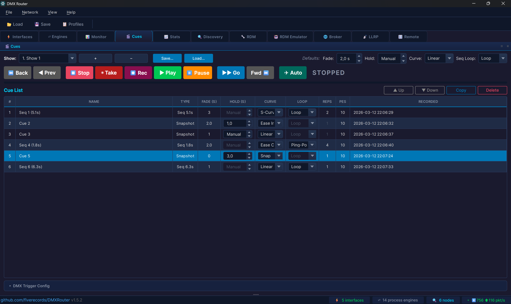
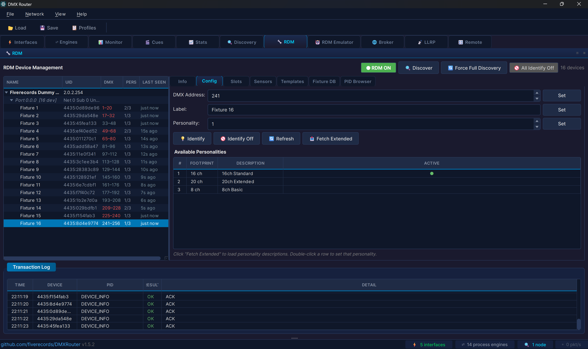
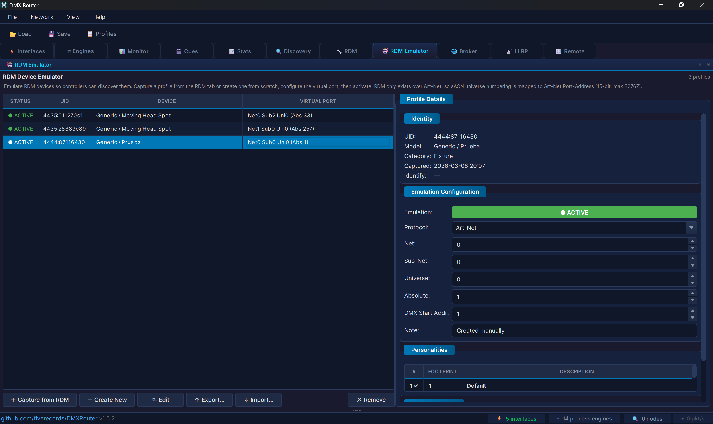
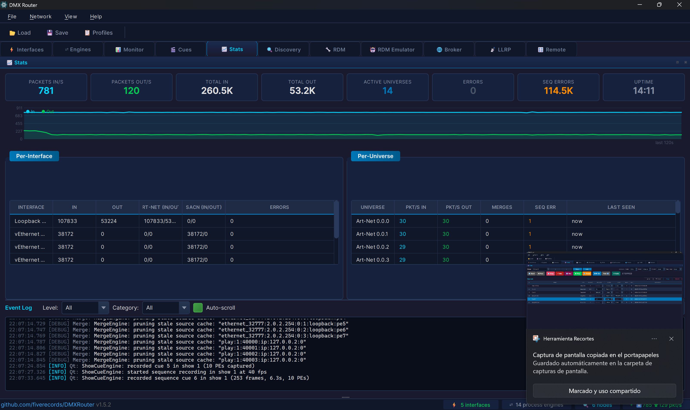
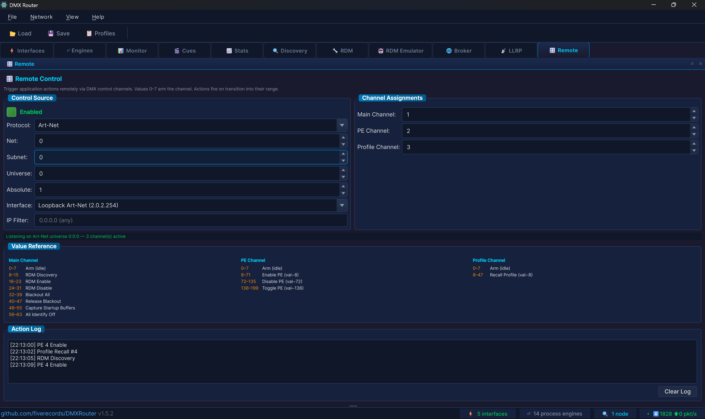
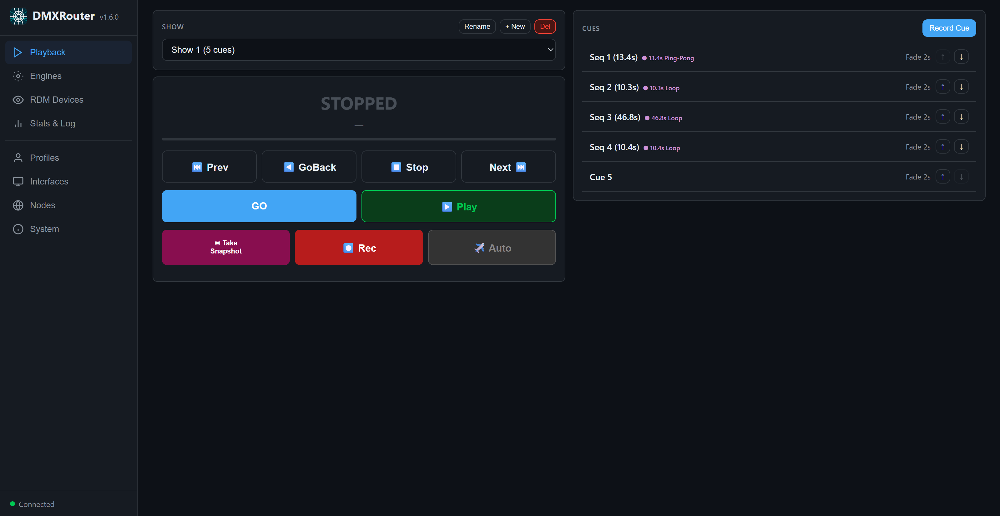

# DMXRouter

[](https://github.com/fiverecords/DMXRouter/releases/latest)
[](https://github.com/fiverecords/DMXRouter/releases)
[](https://github.com/fiverecords/DMXRouter/releases)
[](https://en.cppreference.com/w/cpp/17)
[](https://www.qt.io/)
[](LICENSE)

**Professional DMX512 lighting control router for live entertainment and architectural installations.**

DMXRouter is a high-performance, cross-platform application written in C++ with Qt6 that handles DMX512 data routing, merging, and show management across the major industry protocols. Designed for production environments where reliability and sub-millisecond timing are non-negotiable.

---


## Features at a Glance

- **Multi-protocol routing** — Art-Net 4, sACN (E1.31 2018), with full cross-protocol bridging
- **Internal routing** — cascade process engines for multi-stage merge topologies without physical loopback
- **Universe merge engine** — 8 merge modes including HTP, LTP, Backup, X-Fade, Switch, and Custom per-channel policy
- **sACN per-channel priority** — full E1.31 0xDD support in merge and monitoring, with color-coded priority visualization
- **Dockable panels** — all panels detach into floating windows for multi-monitor setups; drag, double-click, or use Alt+1–0
- **Show cue system** — snapshot and sequence recording, crossfade with selectable curves, autopilot auto-advance, loop/ping-pong playback, DMX remote triggering, and per-show import/export
- **RDM device management** — full E1.20 with device discovery, parameter control, sensor monitoring, self-test discovery and triggering, fixture templates with per-model DMX address assignment, operating hours tracking, Fixture ID (E1.37-5), manufacturer PID browser with per-device value caching, automatic status message drain, customizable device tree columns (including Serial and Rental ID from the Fixture Database), preset scene management (E1.37-1 PRESET_INFO / PRESET_STATUS / CAPTURE_PRESET with inline editing of fade times), and large installation support (100+ fixtures)
- **RDM device emulator** — deep-capture a real fixture's complete RDM identity (every supported PID response stored verbatim), create virtual fixtures from scratch, or edit existing profiles — impersonate them on the network for pre-programming, controller testing, or equipment replacement. Save as reusable templates with full PID data preserved
- **RDMNet / LLRP** — E1.33 broker connection, LLRP device discovery with network recovery (E1.37-2), and identify management
- **Show Mode** — live-show protection lock that blocks destructive and caution-level operations across the desktop GUI, web interface, and REST API while keeping playback fully available
- **Channel-level patching** — per-channel remap, scale (0–200%), min/max limits, CSV import/export
- **Channel history** — oscilloscope-style real-time waveform display for any DMX channel
- **Network discovery** — live Art-Net node and sACN source discovery with protocol-aware remote node configuration. Optional WiFi interface support for preprogramming scenarios without Ethernet
- **VLAN management** — cross-platform virtual adapter management for production network segmentation (Windows Hyper-V, Linux NetworkManager, macOS networksetup). Industry-standard group presets with colour-coded dropdown, plus a Custom entry for any VLAN ID (1–4094). No need to run as root — each platform prompts for the admin password only when needed. VLANs and IPs persist across reboots on all three platforms.
- **Real-time statistics** — per-interface and per-universe throughput metrics with live event log and pop-out log window
- **Universe monitor** — real-time DMX data and sACN priority viewer with per-interface filtering for multi-NIC environments
- **Bulk workflow tools** — Reroute (swap interfaces across multiple engines at once), Rename with auto-increment, Uni −/+ quick universe adjust for all engine modes, Engine Templates for rapid setup, Absolute universe addressing across all panels
- **Engine groups** — organize process engines into collapsible, color-coded groups with drag-free reordering (Move Up/Down), tristate enable/disable, custom display order, and full profile persistence. Groups appear above ungrouped engines like folders before files
- **Profile manager** — save and recall complete configurations, profile preview before loading, preserve IP/VLAN option on recall, import/export profiles between machines, optional startup profile auto-load, periodic auto-save with crash recovery dialog on startup. VLAN restore automatically scans the OS, imports existing adapters, creates missing ones (including vSwitch infrastructure on Windows), and applies saved IP addresses — with adapter selection dialog when multiple NICs are available
- **Update checker** — automatic new version detection via GitHub Releases, with persistent status bar button and per-version dismiss
- **Web remote control** — built-in HTTP + WebSocket server with a responsive web interface. Full engine management (create, edit, delete, enable/disable, switch inputs), RDM device configuration, LLRP discovery and network recovery (E1.37-2), VLAN management, IP editor, universe monitor with live DMX grid, per-universe stats, show control, and profile management from any phone, tablet, or browser on the network. Optional PIN authentication, PWA support (add to home screen), keyboard shortcuts, zero external dependencies
- **Cross-platform** — identical look and feel on Windows, Linux (x86-64 and ARM64), and macOS from a single codebase
- **~67,400 lines of production C++17** — zero compiler warnings with strict flags (`-Wall -Wextra -Wpedantic` / `/W4`)

---

## Table of Contents

- [Architecture](#architecture)
- [Protocol Support](#protocol-support)
- [Internal Routing](#internal-routing)
- [Merge Engine](#merge-engine)
- [Show Cue System](#show-cue-system)
- [RDM & RDMNet](#rdm--rdmnet)
- [RDM Device Emulator](#rdm-device-emulator)
- [Channel Patching](#channel-patching)
- [Channel History](#channel-history)
- [Network Discovery](#network-discovery)
- [VLAN Management](#vlan-management)
- [Statistics & Logging](#statistics--logging)
- [Universe Monitor](#universe-monitor)
- [User Interface](#user-interface)
- [Configuration](#configuration)
- [Web Remote Control](#web-remote-control)
- [Typical Use Cases](#typical-use-cases)
- [Installation](#installation)
- [License](#license)

---

## Architecture

DMXRouter runs on a **single-threaded event-loop architecture** driven by Qt's event system. This is a deliberate design decision: crossfade calculations and merge operations complete in microseconds per tick even at high universe counts, while a multi-threaded worker queue would introduce latency through queued connections. The result is consistent sub-millisecond output timing — critical for live shows.

```
┌───────────────────────────────────────────────────────────┐
│                       Qt Event Loop                       │
├───────────────┬──────────────┬──────────────┬─────────────┤
│ UDPTransport  │ MergeEngine  │ ShowCueEngine│ DiscoveryMgr│
│ (Art-Net /    │ (8 modes,    │ (cue record/ │ (Art-Net /  │
│  sACN RX/TX)  │  512 routes) │  playback)   │  sACN scan) │
├───────────────┼──────────────┼──────────────┼─────────────┤
│ RDMManager    │ RDMNetManager│ PatchManager │ RdmEmulator │
│ (E1.20 RDM)   │ (E1.33/LLRP) │ (ch remap)   │ (virtual fx)│
├───────────────┼──────────────┴──────────────┴─────────────┤
│ WebServer     │          Qt6 GUI (MainWindow + Widgets)   │
│ (HTTP + WS)   │                                           │
└───────────────┴───────────────────────────────────────────┘

```

Key design invariants:

- Per-universe sequence counters (Art-Net and sACN) — compliant with Art-Net 4 §ArtDmx and E1.31 §6.2.6
- Output rate limiter (token bucket at 44 fps / 22.7 ms) — prevents receiver overload per E1.31 §6.6.1, with dirty-flag optimization to skip identical frames and keep-alive emission every ~850 ms
- Socket send/receive buffers at 2 MB — absorbs burst traffic from 40+ simultaneous universes
- Packet rate calculations normalized by actual elapsed time — eliminates jitter from QTimer imprecision under event loop load
- Defensive bounds checking throughout — stale indices and corrupted fade states produce log warnings, never visible artifacts on a live rig

---

## Protocol Support

### Art-Net 4
- Receive and transmit ArtDmx on any local network interface
- ArtPoll / ArtPollReply discovery with manual trigger (no background polling traffic on production networks)
- **Static node entries** — add Art-Net nodes by IP for cross-subnet discovery. ArtPoll is sent unicast to each static node so they appear in the Discovery tab even when broadcast can't reach them. Persistent across sessions. Cross-subnet discovery depends on the node and network configuration — the node must reply with unicast and have a gateway configured
- Remote node configuration via ArtAddress and ArtIpProg
- Multi-bind node merging (combines replies from the same IP across ports)
- Correct per-universe sequence numbering (1–255, wrapping, independent per universe)
- Paced ArtAddress command queue (20 ms between packets) to prevent node RX buffer overflow on multi-port configurations
- ArtSync frame synchronization — buffers ArtDmx and releases on ArtSync for glitch-free output, with 4-second timeout fallback
- Correct broadcast routing on dual-NIC setups — packets go out on the correct interface instead of always using the system's default route

### sACN — ANSI E1.31 2018
- Full multicast and unicast support
- Per-universe per-source priority (0x64 default, 0xDD per-channel override fully supported in merge and monitoring)
- Per-channel priority 0 correctly handled — sources with priority 0 on a slot are excluded from the merge per E1.31 §6.2.3
- **Universe Synchronization** — E1.31 Extended Sync packets (vector 0x00000001) for glitch-free multi-universe refresh on LED walls and large installations
- **Configurable monitor range** — by default, universes 1–1024 are joined for multicast reception so incoming sACN traffic is visible immediately in the monitor and available for routing. Adjustable via a spinner in the Monitor tab toolbar (0–63999). Universes required by process engine inputs are always joined regardless of this setting
- Universe Discovery (10-second cycle with pagination)
- Stream termination handling
- Protocol-aware sequence validation (0 is a valid wrap value in sACN, unlike Art-Net where seq 0 means "disabled")
- Self-send detection via CID — prevents processing our own multicast packets on loopback

### Cross-protocol bridging
Any input protocol can be routed to any output protocol. Art-Net → sACN, sACN → Art-Net, or same-protocol universe remapping — all configurable per route.

---

## Internal Routing

The output of one process engine can be fed as the input to another, enabling cascading merge topologies without requiring physical network loopback.

- **Engine-to-engine selection** — the merge editor lists all available engines with their output targets; selecting one automatically links the routing
- **Per-engine sender keys** — each engine's internal output uses a unique cache key, preventing collisions when multiple engines share the same output universe
- **Keep-alive propagation** — when a source drops, the upstream engine's keep-alive data continues to feed downstream engines, preventing cascading failures through the routing chain
- **Failsafe hold propagation** — hold-last-state behaviour propagates correctly through internal routing chains, including Full and Scene failsafe modes which are now forwarded to downstream engines immediately
- **Physical loopback** — for same-interface routing scenarios where the "OWN" checkbox is enabled, data is injected directly without requiring an external network path
- **Recursion guard** — maximum depth of 4 prevents infinite loops in circular topologies

---

## Merge Engine


Each merge engine accepts **up to 4 inputs** and produces one merged output. Up to **512 engines** can run simultaneously.

### Merge Modes

| Mode | Description |
|------|-------------|
| **HTP** | Highest Takes Precedence — maximum value per channel across all inputs |
| **LTP** | Latest Takes Precedence — most recently updated source wins per channel |
| **Backup** | Primary input active; secondary takes over automatically when primary times out |
| **X-Fade** | Crossfade between two sources via a DMX control channel (0 = input 1, 255 = input 2) |
| **Switch** | Select one of up to 4 inputs via DMX control values (8–15 = input 1, 16–23 = input 2…) |
| **Custom** | Per-channel merge policy — each of the 512 channels independently set to Input1/2/3/4, HTP, or LTP |
| **sACN Priority** | Merges sources using E1.31 per-channel priority values; priority 0 excludes a source from the slot |
| **Preset / Snapshot** | Startup buffer that holds the last known state across power cycles |

### Per-engine Features

- **Master / Limit** — scale the entire output (0–100%) and set per-channel hard limits
- **Source IP filter** — accept data only from specific IP addresses
- **Accept Own Data** — control whether the engine processes packets from its own output interfaces
- **Accept Preview** — discard or accept sACN preview data packets (E1.31 bit 7)
- **Startup buffer** — send a stored snapshot while waiting for live sources to appear
- **Failsafe** — configurable behaviour when all sources time out: hold last, go to black, send full, or play a recorded scene
- **Channel patch** — per-channel remap applied after merge, before transmission
- **Enable / disable** — engines can be toggled on and off without losing their configuration

---

## Show Cue System



DMXRouter includes a complete show programming and playback engine for automated lighting control, supporting both instantaneous snapshots and time-based sequence recordings.

### Cue Types

**Snapshot** — captures the live merged DMX output across all active process engines as a single static frame. The classic cue type for theatrical and event lighting.

**Sequence** — records live DMX data over time at 40 fps (25 ms intervals, matching DMX refresh rate). Click ⏺ Rec to start recording while DMX is flowing, click again to stop. The result is a timeline cue that plays back the captured movement exactly as it happened — similar to a standalone DMX recorder, but integrated into the show system.

### Shows and Cue Management

- Up to **40 shows**, each with up to 999 cues
- Each cue stores per-engine DMX state (512 channels × engine count)
- Cues carry individual fade times, user labels, and recording timestamps
- **Copy** — copy selected cues within the same show or to a different one
- **Reorder** — move cues up or down in the list
- **Renumber** — renumber selected cues or all cues with a start/step pattern (e.g. 1, 1.5, 2, 2.5)
- **Undo** — 20-level undo stack (Ctrl+Z / Cmd+Z) covering delete, edit, and renumber operations
- **Import / Export** — export individual shows to standalone JSON files for sharing between DMXRouter installations or as backups, import shows without replacing existing ones

### Playback

- **Go** — advance to the next cue with a smooth crossfade
- **Jump** — go to any cue by index
- **Prev / Next** — pre-select the previous or next cue without triggering
- **GoBack** — fire the previous cue
- **Play / Pause** — single toggle button; starts playback, pauses mid-crossfade or mid-sequence, and resumes from exactly where it stopped
- **Stop** — halt playback and inject a blackout
- **Hold timer** — configurable auto-advance delay before the next cue fires

### Crossfade Engine

- 40 Hz update rate (25 ms tick) for smooth transitions
- Per-channel interpolation across all 512 channels of every active engine
- Flash-free cue jumps after a Stop state (skips the crossfade to prevent ghost-frame artifacts)
- When a crossfade starts from a playing sequence, DMXRouter snapshots the current frame and uses it as the fade source — no visual glitch from rewinding

### Fade Curves

Every cue has a selectable curve that shapes how the crossfade progresses:

| Curve | Behaviour |
|-------|-----------|
| **Linear** | Constant rate (default) |
| **S-Curve** | Smooth acceleration and deceleration (3t²−2t³) |
| **Ease In** | Starts slow, finishes fast |
| **Ease Out** | Starts fast, finishes slow |
| **Snap** | Instant jump at the midpoint of the fade time |

### Sequence Playback Modes

Each sequence cue has a Loop setting:

- **Once** — plays through the timeline once, then holds the last frame
- **Loop** — restarts from the beginning when it reaches the end
- **Ping-Pong** — reverses direction at each end, creating a back-and-forth effect

### Autopilot

When autopilot is enabled (✈ Auto), the engine automatically advances to the next cue after the current one finishes playing (including any hold time). Sequence cues respect the **Reps** column — the sequence plays the specified number of complete cycles before advancing. Playback stops at the end of the cue list.

### DMX Remote Control

- Any DMX channel on any universe can trigger application actions from a lighting desk
- **Main channel** — RDM Discovery, RDM Enable/Disable, Blackout All/Release, Capture Startup Buffers, All Identify Off, Alert Identify On/Off, Template Auto-Apply On/Off, Template Apply DMX Address On/Off
- **PE channel** — Enable/Disable/Toggle individual process engines by index
- **Profile channel** — Recall saved profiles by number
- Arm / disarm prevents accidental triggers on startup
- Gap guard prevents action flooding from noisy DMX faders

---

## RDM & RDMNet



### RDM — ANSI E1.20
- Discover devices on any Art-Net universe (ArtRdm packets)
- Identify, set DMX start address, device label, and personality
- **Identify management** — visual 💡 indicator and amber highlight in the device tree on identify, quick-access **Identify toggle** and **All Off** panic button in the tree toolbar (no need to switch tabs), dedicated Identify Off button in the Config tab, right-click context menu (Identify On / Off). The identify icon does not affect alphabetical sort order in the device tree
- Read 19+ PIDs: device info, manufacturer, model, personality list, DMX address, identify state, sensor definitions and values, lamp state, lamp on mode, product detail, supported parameters, and more
- PID Browser for raw GET/SET of any standard or manufacturer-specific parameter. Smart SET detects numeric PIDs with PARAMETER_DESCRIPTION and shows a value dialog with range instead of raw hex
- **Auto-fetch on device selection** — selecting a device automatically reads all extended and advanced info (personalities, sensors, hours, boot software, language, presets). The Refresh button re-reads everything in one click. A progress bar shows loading status
- **Manufacturer PIDs** — auto-read values on device selection. Right-click to GET or Set Value with a smart numeric dialog based on the PID's parameter description (type and range). Hex fallback for non-numeric types
- **Absolute universe in device tree** — port items show both Net.Sub.Uni notation and the absolute universe number (1–32767). Ports configured as sACN display "sACN Universe X" instead of Art-Net notation. The Gateway label in the Info tab also displays the absolute universe and protocol
- **Device Model ID** — the numeric DEVICE_MODEL_ID from DEVICE_INFO is displayed in hexadecimal in the Info tab, alongside the human-readable model name
- **Reorderable inspector tabs** — drag RDM sub-tabs (Info, Config, Slots, etc.) to customize the order. Layout is saved across sessions and reset via View > Reset Tab Layout
- 3-second transaction timeout with automatic retry (up to 2 retries per transaction)
- **Sequential probing** — fixtures are queried one at a time with 50 ms spacing, preventing gateway buffer overflow on cheap Art-Net nodes and cutting probe time from 9+ seconds to ~1.5 s on large rigs
- **ACK_TIMER** — fixtures that need extra time (personality change, factory reset, firmware) are retried after their requested delay. SET commands are verified with a GET per E1.20 §5.3.2; GET commands are re-sent with the original parameters
- **ACK_OVERFLOW** — fixtures with 115+ supported PIDs that split responses across multiple packets are reassembled transparently
- **Full UTF-8 support** — manufacturer, model, label, software version, personality names, slot names, and sensor names display correctly in Chinese, Korean, and other non-Latin scripts
- Full device cache with parameter persistence
- **Personality column** — "Pers" column in the device tree shows the current mode (e.g., `3/12`) at a glance
- **Fixture ID column** — "FID" column shows the E1.37-5 DEVICE_UNIT_NUMBER next to the DMX address, with GET/SET support in the Config tab
- **Status message indicators** — the Status column shows ⚠ (red/orange) or ℹ (green) when a device has reported errors, warnings, or advisories via status messages. Tooltip shows the count breakdown
- **Automatic status message drain** — when any RDM response has `messageCount > 0`, DMXRouter automatically drains the device output queue via GET QUEUED_MESSAGE. Persistent-status devices (direct-read model) are detected by tracking messageCount across iterations and stop after two requests to avoid monopolizing the bus. Status messages are accumulated per device and displayed in the tree and Status tab without manual polling
- **Self-test workflow** — discover available self-tests via SELF_TEST_DESCRIPTION, trigger any test via PERFORM_SELFTEST from a dropdown in the Status tab, and monitor completion with automatic polling. Test results arrive as status messages via the auto-drain and appear in the status table and tree indicators
- **Batch operations** — multi-select devices in the tree (Ctrl+click / Shift+click) and right-click: Identify All On/Off, Set Personality on all selected, Set Sequential Addresses (auto-increments by footprint), Set Same Address (all selected get the same address — useful for testing or warehouse patching), Fetch Info for all at once. The Config tab also has **Seq** buttons for DMX Address (footprint-aware) and Fixture ID (increments by one), and the Identify toggle applies to all selected devices
- **Sensor progress bars** — graphical bars in the Sensors tab with color coding: green within normal range, orange outside. Fallback to plain numbers when no range is defined
- **Preset scenes** — dedicated Presets tab for fixtures with internal scene storage (E1.37-1). Reads PRESET_INFO capabilities, fetches all scenes via PRESET_STATUS with sequential paced queries, displays fade up/down and wait times in an editable table (inline spinboxes for "Programmed" scenes, read-only for factory presets). Playback controls (Go/Off with scene selector), merge mode combo (Default/HTP/LTP/DMX Only), Capture to Scene, and Clear Scene — all without leaving the tab
- **DMX address overlap warning** — fixtures on the same port with overlapping channel ranges are highlighted in red with a conflict tooltip
- **Stale indicator tuned for scale** — 3-minute threshold prevents healthy fixtures from greying out on large installations where keepalive cycles exceed 60 seconds
- Interactive device tree in the **🔧 RDM** tab, sorted by DMX start address with device counts per port, DMX address ranges, and last-seen timestamps
- **Customizable columns** — right-click the device tree header to show/hide columns (including Manufacturer and Model) and drag to reorder. Layout persists across sessions
- RDM is **off by default** — toggle on via toolbar to avoid unintended bus traffic during live shows

### Fixture Templates
- Save a device's configuration (DMX address, personality, label, and parameters) as a reusable template keyed by manufacturer and model ID
- **Personality offline editing** — all available modes are cached in the template at save time. Change the personality in the template table or settings dialog even when the fixture is offline — no need to rediscover
- **DMX address per model** — each template stores an optional DMX start address, editable directly in the template table. A global toggle — *Apply DMX address when using templates* — controls whether the address is sent to devices, making it easy to keep addresses configured but only activate them when needed (e.g., warehouse testing where every fixture of a model should start on the same channel)
- **Lamp hours limit per model** — set a warning threshold in the template table. When a discovered device exceeds this value, the device name turns orange in the tree and the Info tab highlights the lamp hours in red
- **Device hours limit per model** — same concept for LED fixtures that don't report lamp hours. Set a device hours threshold and get the same orange/red warnings when a fixture exceeds its service interval
- **Firmware mismatch warning** — templates capture the firmware version at save time. When applying to a device running different firmware, a warning dialog explains that personalities or behavior may have changed. Auto-apply logs mismatches to the transaction log. The template table shows the Model column in orange when a discovered device has a different firmware
- **Auto-apply on discovery** — newly discovered devices matching a saved manufacturer/model pair receive their template configuration automatically, enabling hands-free commissioning of replacement fixtures
- **Alert identify** — optional toggle that automatically puts fixtures into RDM Identify mode when a firmware mismatch or lamp/device hours limit is detected. The fixture flashes on the rig so the technician can locate it without checking the screen — useful for pre-show checks in large installations
- **Fetch All** — one-click button in the header bar to fetch extended info (personalities, sensors, operating hours) for every discovered device at once, with progress bar and cancel support. No need to click each fixture individually
- Templates stored as JSON and persist between sessions
- Manual apply available for selective deployment from the Templates tab
- **Station Sync** — bidirectional synchronization of templates and fixture database across multiple DMXRouter stations. New data on either side is exchanged automatically; template conflicts are detected by modification timestamp and resolved via an interactive dialog (Keep Local / Accept Remote / Skip). Fixture records merge automatically with the newer version winning. Configure a source station URL in the Templates or Fixture DB tab. Ideal for multi-station warehouse or venue installations where multiple machines manage the same fixture inventory

### Fixture Database
- Track operating hours, lamp hours, and power cycles for every RDM device in the installation
- Timestamped snapshots build a usage history per fixture for maintenance planning
- **Visual grouping by manufacturer and model** — fixtures are grouped with collapsible header rows showing the group name and count, sorted alphabetically for quick navigation in large inventories
- **Editable Serial Number, Rental ID, and Notes columns** — double-click to edit, values persist across sessions in the JSON database and are included in all CSV exports. Useful when the printed serial number doesn't match the RDM UID
- **Serial and Rental ID columns in the RDM device tree** — hidden by default, right-click the header to enable them. Values are pulled from the Fixture Database
- **Scan Mode** — barcode scanner workflow for assigning serial numbers to fixtures. Walks through every fixture without a serial, sends RDM Identify On (fixture blinks), places the cursor in the Serial field, and auto-advances when the scanner enters a value. Works with any USB barcode scanner that acts as a keyboard
- **Import DB** — import serial numbers and rental/asset IDs from CSV or Excel (.xlsx) files exported from rental software (Rentman, d&b, or any custom export). Column mapping dialog with data preview, automatic CSV separator detection (comma, semicolon, tab), and a match report showing which fixtures were updated and which serial numbers had no match
- **Manual fixture entries** — right-click the fixture table to add entries for non-RDM equipment. Manual entries use a synthetic UID and allow editing the Manufacturer and Model columns directly
- **Recording toggle** — pause and resume database writes without stopping RDM discovery; existing data is preserved
- LED fixtures that don't support lamp hours no longer show misleading "0 hours" entries
- CSV export for integration with external asset management and maintenance scheduling tools
- **CSV auto-export** — point to an external CSV file that updates automatically every time the database changes, for live integration with inventory software on a shared drive or NAS
- Database cleanup to clear fixtures from previous sessions or venues
- Configurable minimum interval between snapshots to prevent redundant recordings

### RDMNet — ANSI E1.33 / LLRP
- **LLRP discovery** — multicast probe on 239.255.250.133 and 239.255.250.134 with interface-specific binding and TTL=1 (link-local). Interface selection is mandatory — no "All Interfaces" mode to prevent accidental multicast leakage. Interface dropdown refreshes automatically when VLANs are created/removed or cables are plugged in, and filters out system adapters (Hyper-V Default Switch). Manual Refresh button also available
- **RDM over LLRP** — send RDM commands to LLRP targets without an Art-Net path. Auto-fetches device info and network configuration on target select (no half-duplex bottleneck). Queries SUPPORTED_PARAMETERS first to avoid sending unsupported PIDs
- **LLRP network recovery (E1.37-2)** — read and set static IP, subnet mask, gateway, and DHCP mode on any LLRP target. Fields pre-fill from the device's current configuration. DHCP toggle visually disables static fields. Staged re-read after apply catches DHCP lease assignments. Confirmation dialog warns before applying changes that could make the device unreachable
- **Identify management** — identify icon and amber row highlighting in the LLRP target table, matching the RDM device tree visual style. Identify state is cached per target and synced to the toggle button on select
- **Broker connection** — TCP with full Client Connect handshake, 15-second heartbeat, Client Fetch List, RPT Request/Notification/Status, and broker redirect (IPv4 and IPv6)
- CID-based packet filtering prevents processing responses intended for other controllers on the same network
- Corrupt TCP stream detection with immediate disconnect on invalid ACN headers
- Dedicated **🌐 RDMNet** tab with LLRP target list, broker controls, and client roster

---

## RDM Device Emulator



DMXRouter can impersonate RDM fixtures on the network — useful for pre-programming shows before hardware arrives, testing RDM controllers, or keeping console configurations stable when swapping equipment.

### Capture and emulate

Right-click any discovered device in the RDM tab and select **🤖 Capture for Emulation** to perform a **deep capture**: DMXRouter first fetches all advanced parameters, then sends a sequential GET for every PID the device supports. The raw response bytes are stored alongside the standard identity data (manufacturer, model, label, DMX footprint, personalities, slot map). The result is a perfect replica — any RDM controller querying the emulated device gets the exact same bytes the real fixture returned, including manufacturer-specific PIDs. In the **🤖 Emulator** tab, assign a virtual Art-Net port address and activate the profile.

### Create from scratch

Click **＋ Create New** to define a virtual fixture without needing a physical device on the network. The dialog lets you configure manufacturer, model, device label, software version, product category, multiple personalities with individual channel counts, a full slot/channel map using standard E1.20 slot labels (Intensity, Red, Green, Blue, Pan, Tilt, Zoom, Gobo, Strobe, and more), and optional preset scene support with configurable scene count. The slot table auto-resizes to match the first personality's footprint and preserves descriptions when the channel count changes.

### Edit existing profiles

Click **✎ Edit** or use the right-click context menu to modify any profile — whether captured or manually created. The same dialog opens with all fields pre-filled. The UID, virtual port, active state, and any runtime changes made by controllers (DMX address, personality, label) are preserved.

### What controllers see

- Device appears in RDM discovery immediately — no manual TOD flush needed
- Responds to GET/SET for all standard PIDs: DEVICE_INFO, MANUFACTURER_LABEL, DEVICE_MODEL_DESCRIPTION, DEVICE_LABEL, SOFTWARE_VERSION_LABEL, SUPPORTED_PARAMETERS, DMX_START_ADDRESS, DMX_PERSONALITY, DEVICE_HOURS, DEVICE_POWER_CYCLES, slot descriptions, and more
- **Deep capture fallback** — any PID not handled by explicit emulator logic is answered from the captured raw response bytes. Manufacturer-specific PIDs, product details, boot info, and anything else the real device reported are replayed verbatim
- NACK with the correct reason code for unsupported PIDs
- Identify state can be toggled from the Emulator panel and is reflected in RDM responses
- DMX start address and personality changes made via RDM are applied immediately and persist

### Profile management

- **Duplicate** — clone a profile and assign it a new UID for emulating multiple units of the same fixture type
- **Export / Import** — save profiles as `.dmxrprofile` files to share between installations or build a library offline
- **Save as Template** — button and right-click menu option to save a profile (including all deep-captured PID responses) to the Template Library for reuse. Instances created from templates inherit the full captured data
- Each profile shows when it was captured, an optional user note, and the full personality and slot breakdown

### Technical details

- Emulated devices are advertised via ArtPollReply as additional bind indices, grouped by Net and Subnet per Art-Net spec
- **Local loopback** — emulated devices respond locally without network round-trip. DMXRouter's own RDM controller communicates directly with the emulator via an internal handler, bypassing the self-send filter. External controllers on the network also see and interact with emulated devices via ArtRdm
- **Deep capture storage** — raw PID response bytes are serialized as hex→base64 in the JSON profile, surviving export/import and template conversion. Profiles captured from real fixtures can contain 30–80+ PID responses depending on the device
- Preset scene support — emulator profiles can optionally expose E1.37-1 preset PIDs with configurable scene count and demo data for testing
- Works with any Art-Net 4 controller; tested against DMXRouter's own RDM controller, dummyRDM, and real hardware gateways

---

## Channel Patching

Full channel-level remapping applied after merge and before output.

- **512-channel remap** — any input channel to any output channel
- **Scale** — multiply each channel value from 0% to 200%
- **Min / Max clamp** — hard floor and ceiling per channel
- **Bulk operations** — identity reset, channel offset, range map, pair swap, reverse, fan-out, dimmer curve
- **Presets** — save and recall patch configurations
- **CSV import / export** — compatible with standard patch sheets
- **Mini-map** — 32×16 visual overview of the complete 512-channel patch
- **Fixed-width table** — columns sized to fit numeric content with no horizontal scrolling

---

## Channel History

The universe monitor includes an **oscilloscope-style waveform display** for detailed channel-level analysis.

- **Step-style DMX trace** with gradient fill, matching the discrete nature of DMX values
- **Selectable time windows** — 5s, 10s, 30s, or 60s of history
- **Pause / resume** — freeze the view for inspection without losing incoming data
- **Hover crosshair** — shows exact value and timestamp at any point on the waveform
- **Min / max band** — dashed indicators show the value range over the visible window
- **60 FPS rendering** with sub-pixel precision and smooth continuous scrolling
- **Sample deduplication** — stable channels consume minimal memory regardless of observation time

---

## Network Discovery


The **🔍 Discovery** tab shows all Art-Net nodes and sACN sources visible on the network in real time.

**Art-Net nodes:** short name, long name, firmware version, IP, port count, active universes. Remote configuration via ArtAddress and ArtIpProg directly from the UI. Dynamic port controls adapt to the actual port count reported by each node, with per-port universe display, merge mode, direction, RDM enable, output style, and protocol selection. Art-Net universes show absolute universe numbers alongside the standard Net.Subnet.Universe notation. Nodes removed 60 seconds after last reply.

**Protocol-aware port configuration** — switching a port between Art-Net and sACN adapts the addressing UI automatically: sACN hides Net/Subnet and expands Universe to 1–32,767, Art-Net shows the traditional Net / Subnet / Universe fields with a fully editable Absolute column that auto-syncs with the individual address fields. Switching preserves the displayed universe number — no manual recalculation needed.

**sACN sources:** source name, CID, IP, universe list. Sources removed 15 seconds after last packet.

**Node configuration** includes failsafe mode control (hold last state, all off, all full, playback scene, record scene) with intelligent detection of node capabilities — commands are sent even when nodes don't advertise support, with a clear tooltip advisory.

ArtPoll is **manually triggered** via toolbar button to avoid continuous background traffic on production networks.

---

## VLAN Management

DMXRouter provides cross-platform virtual network adapter management for production network segmentation. On all three platforms, VLANs are created as persistent OS-level network configurations that survive reboots — no need to reconfigure after a power cycle.

**No root / sudo / Administrator required to launch.** The application runs as a normal user. When you create, remove, or configure a VLAN, the operating system shows its standard password dialog — just like installing software. You type your password once and it's cached for the session.

### Windows (Hyper-V)
- Create / destroy Hyper-V Virtual Switch via asynchronous PowerShell
- Add and remove VLANs with configurable IDs and names
- Colour-coded VLAN table with industry-standard group colour presets
- Adapter filtering hides system adapters (Default Switch, management NICs)
- Network diagnostics panel
- Requires: Windows Pro/Enterprise with Hyper-V feature enabled

### Linux (NetworkManager)
- VLAN creation via `nmcli` with persistent NetworkManager connections
- Admin privilege elevation via PolicyKit (`pkexec`) — no need to run as root
- IP address assignment persists across reboots
- Short kernel interface names (`dmxr.200`) within the 15-character IFNAMSIZ limit
- **Automatic IGMP multicast limit raise** — sACN uses one multicast group per universe; the default Linux limit (20) is too low for professional setups. DMXRouter detects and raises it to 1024 on startup
- Requires: NetworkManager (`sudo apt install network-manager` if not present)

### macOS (networksetup)
- VLAN creation via `networksetup` — each VLAN appears as a real network adapter in System Settings → Network
- Admin privilege elevation via the native macOS password dialog — no need to run with `sudo`
- IP address assignment persists across reboots
- VLAN tag resolution via kernel ioctl for correct VLAN colour mapping regardless of creation order

### Consistent across platforms
- **Custom VLAN ID** — a "Custom" entry at the top of the VLAN dropdown lets you type any VLAN ID (1–4094), not just the standard group presets
- **VLAN 1 (Management / untagged)** is shown in the VLAN table on all platforms, representing the parent NIC. You can assign an IP to the parent NIC directly from the VLAN Manager.
- **Set IP / Set DHCP** — assign a static IP or switch to DHCP from a single dialog, available in both the VLAN Manager and the Interfaces tab. The dialog detects the current mode (manual/DHCP) and pre-fills the current IP and subnet mask.
- **IP addresses saved in profiles** — VLAN IPs are read from the OS at save time and stored in profiles and configs. When loading on a different machine, IPs are restored automatically after VLAN creation. On the same machine, IPs are only reassigned when they differ from the current OS configuration.
- **Cross-platform profile portability** — VLAN profiles saved on Windows can be loaded on Mac/Linux and vice versa. The VLAN 1 management adapter is remapped to the local physical NIC automatically.
- **Subnet Mask column** in the VLAN table for at-a-glance network configuration.
- **Friendly interface names** — macOS shows networksetup service names ("Thunderbolt Ethernet"), Linux shows NetworkManager connection names ("Wired connection 1") instead of kernel device names.
- WiFi adapters, VPN tunnels, TAP adapters, Bluetooth PAN, Docker bridges, and other non-Ethernet interfaces are filtered from the interface list. On Windows, adapter hardware descriptions are resolved via `GetAdaptersAddresses` to catch VPN/tunnel adapters that report as Ethernet.
- **Disconnected adapters** (no link / cable unplugged) are shown dimmed with an Enable checkbox so you can pre-configure them before connecting the cable
- A clear advisory guides the user when prerequisites are not met
- Scan for existing VLANs created outside DMXRouter

---

## Statistics & Logging



The **📈 Stats & Log** tab provides live operational visibility.

**Metrics dashboard** — 8 live cards: Packets In/s, Packets Out/s, Total In, Total Out, Active Universes, Error Count, Sequence Errors, Uptime. Colour-coded green / red / grey by state. Packet rates are normalized by actual elapsed time to eliminate jitter under load.

**Throughput chart** — rolling 2-minute history (120 snapshots), rendered with QPainter. Cyan for inbound, green for outbound, semi-transparent fill, auto-scaling Y axis with smooth decay to prevent visual jumps on scale changes.

**Per-interface breakdown** — packet counts, Art-Net / sACN protocol split, error totals.

**Per-universe breakdown** — packet rates, merge operation counts, sequence errors, last-seen timestamp.

**Event log** — ring buffer of 10,000 entries, thread-safe. Captures all `qDebug` / `qInfo` / `qWarning` / `qCritical` output. Automatic category tagging (ArtNet, sACN, Transport, Merge, Discovery, Network, System). Filterable by level and category. Auto-scroll toggle, Clear button, monospace font. **Pop-out button** detaches the log into its own window — filters, auto-scroll, and live entries keep working while floating; close or click Dock to snap it back.

---

## Universe Monitor


The **📊 Monitor** tab provides a real-time view of all DMX data flowing through the system.

- **Per-interface filtering** — dropdown populated dynamically as interfaces appear, allowing inspection of specific network paths when the same universe arrives on multiple NICs or VLANs
- **Direction filter** — isolate input-only or output-only traffic
- **Protocol filter** — view Art-Net, sACN, or both
- **DMX / Priority view toggle** — switch between standard DMX levels (0–255) and sACN per-channel priority data (0xDD start code). Priority view uses a dedicated color palette: blue (low) → green (default 100) → orange/red (high/max 200). Hover shows the exact priority value and level label
- **Priority indicators** — universe list entries carrying 0xDD data show a `[P]` tag; when multiple sources disagree on priority, both values are shown (e.g., `pri:100/150`)
- **Grid view** — 32×16 channel grid with colour-coded values and amber selection highlight
- **Absolute universe display** — Art-Net universes show `0.1.0 (17)` with 1-based absolute numbering
- **Active channel count** — shows how many channels are above zero
- **Channel history** — click any channel to open the oscilloscope waveform view
- **Source name display** — shows the sender's name next to each universe in the list. sACN sources display their Source Name (E1.31 bytes 44–107, cached per CID); Art-Net sources display the Short Name from the most recent ArtPollReply, falling back to the sender's IP address when no ArtPollReply has been received. Example: `⬇ sACN 1 [VLAN 200] "My Console" ● 42ch`
- **VLAN-friendly naming** — long adapter names like `DMXRouter_VLAN200` are automatically abbreviated to `VLAN 200` for readability
- **sACN monitor range** — configurable in the Monitor tab toolbar (default: 1024 universes). Controls how many sACN multicast groups are joined automatically. Increase for large pixel-mapping or media server setups; universes beyond the range are still received if referenced by a process engine input

---

## User Interface



### Dockable Panels
All panels (Interfaces, Engines, Monitor, Cues, Stats, Discovery, RDM, RDM Emulator, Broker, LLRP, Remote Control) can be **reordered by dragging** and **detached into floating windows** — drag horizontally to reorder, drag vertically to float. Ideal for multi-monitor setups: put the Monitor on your FOH screen, Engines on the tech desk, RDM on a tablet. Closing a floating panel snaps it back into the main window — panels are never lost. Tab order and window position are saved across sessions. Use View > Reset Tab Layout to restore the default arrangement.

### Bulk Workflow Tools
- **Reroute** — when a network interface changes IP, select the affected engines, click Reroute, and a From → To dialog swaps one interface for another across all selected engines at once (inputs, outputs, and control channels). Single-selection mode shows a per-slot detail view for fine-tuning.
- **Rename with auto-increment** — select several engines, click Rename, enter a base name ending in a number (e.g., "Stage 1"), and they are named Stage 1, Stage 2, Stage 3 in selection order.
- **Absolute universe field** — all control source panels (Remote Control, Show Cue, merge editor) include an Absolute field that combines Net/Subnet/Universe into a single number. Editing Absolute updates Net/Subnet/Universe and vice versa; switching between Art-Net and sACN preserves the universe address. A **View → Art-Net 0-based universe numbering** toggle switches between the traditional 1-based display (Art-Net 0.0.0 = Universe 1) and native 0-based display (Art-Net 0.0.0 = Universe 0) across all panels and the web interface.

### Cross-Platform Visual Consistency
The interface looks identical on Windows, macOS, and Linux — same font (Inter), same colors, same spacing. Platform-specific adaptations happen under the hood:

- **Windows** — FreeType font engine eliminates the colored ClearType fringing on dark backgrounds
- **macOS** — stylesheet font sizes scaled for Retina displays; native file dialogs restored for Sequoia compatibility; App Nap disabled so DMX output stays active when the window loses focus; correct system monospace font (Menlo) used in all technical readouts
- **Linux** — consistent Fusion style with bundled Inter font; system monospace font (DejaVu Sans Mono) for technical readouts

---

## Configuration

All settings are saved to a single JSON file via **File → Save Config** (Ctrl+S) and restored with **File → Load Config** (Ctrl+O). The file includes: routing table, merge engine configurations, channel patches, show cues, VLAN settings, discovery preferences, and application version. The application tracks unsaved changes and prompts on close — if the save fails (permissions, disk full), the close is aborted so no work is lost. All persistent files (profiles, RDM templates, emulator profiles) use atomic writes to prevent corruption from power loss or crashes.

**Profile Manager** allows saving named snapshots of the complete configuration for quick recall during productions. Up to 40 profiles stored on disk. A profile can be pinned as **⭐ Startup Profile** to load automatically on launch instead of the last session. Profile preview shows engine details before loading. Import/export profiles as portable JSON files for sharing between machines. The **Preserve IP** option (enabled by default) keeps the current network and VLAN configuration when recalling a profile from a different machine. When disabled, DMXRouter scans the OS for existing VLAN adapters, imports matching ones without recreating them, creates any missing VLANs (including vSwitch infrastructure on Windows), and restores saved IP addresses — only reassigning when the current IP differs. If multiple physical NICs are available, a dialog asks which one to use for VLAN creation. File → Load Config includes the same Preserve IP checkbox.

**Engine Templates** — the Templates button in the process engine toolbar creates pre-configured engine batches (8×/16× Forward sACN, 8×/16× Forward Art-Net, HTP Merge, LTP Merge, Backup Pair, X-Fade, Switch) with auto-assigned universe numbers based on existing engines.

**Session persistence** — enabled network interfaces, VLANs (with IP addresses), and cue recorder state are saved independently of process engines and restored on every launch, even with no engines configured. Interface state is also saved in profiles and configs, so loading a configuration re-enables the same interfaces that were active when it was saved. When VLANs need to be created asynchronously, an event-driven deferred enable waits for each VLAN operation to complete before enabling the corresponding interface — adapting to any OS timing without hardcoded delays. Transport rebuilds are suppressed during the process and a single clean rebuild occurs when all interfaces are ready.

**Update checker** — automatically checks GitHub for new releases at startup (with a 3-second delay). When a new version is available, a persistent orange button appears in the status bar; clicking it opens a dialog where you can download the update, dismiss it for later, or ignore that specific version permanently. Manual check available in the Help menu. Platform-specific asset detection for direct download links.

Example configuration excerpt:

```json
{
  "merges": [
    {
      "name": "FOH Merge",
      "output": { "protocol": "sacn", "universe": 1 },
      "mode": "htp",
      "inputs": [
        {
          "source": { "protocol": "artnet", "net": 0, "subnet": 0, "universe": 0 },
          "interface": "eth0:10.0.0.1",
          "priority": 100
        }
      ],
      "master": 100,
      "failsafe": "hold"
    }
  ]
}
```

---

## Web Remote Control



DMXRouter includes an embedded **HTTP + WebSocket server** with a **built-in web interface** accessible from any browser on the network. Control playback, manage engines, monitor RDM devices, and view live stats from a phone, tablet, or laptop — no app install required.

The server starts automatically on launch and listens on **port 9090** (HTTP) and **port 9091** (WebSocket). Point any browser at `http://<dmxrouter-ip>:9090` to open the interface. The API is also directly usable from curl, Postman, Bitfocus Companion, or custom automation scripts.

### Web Interface

The web interface is a responsive single-page application embedded in the binary — no external files, no CDN, no build step. Dark professional theme matching the desktop application. Sidebar navigation on desktop (≥768px), bottom tab bar on mobile.

- **Playback** — full show management with all 9 transport controls (⏮️ Prev, ◀️ GoBack, ⏹️ Stop, Next ⏭️, GO, ▶️ Play / ⏸️ Pause, ◉ Take Snapshot, ⏺️ Rec, ✈️ Autopilot), cue list with inline editing, preset cue highlight, live fade and sequence progress bars, playback state per cue. Keyboard shortcut: spacebar = GO
- **Engines** — create new engines (name, mode, input/output with protocol, universe, and interface selection), rename, delete with confirmation. Enable/disable toggles, snapshot/failsafe, channel patch editing, 512-channel DMX output grid with color-coded intensity and fullscreen mode, tap any cell for channel number. Global blackout, Show Mode toggle with sticky banner
- **RDM Devices** — device list grouped by gateway with search/filter, DMX address range with conflict highlighting, Fixture ID, personality, probe progress, status indicators. Inline SET for address, personality, and label. Expandable detail panel: operating hours, Fixture ID set, Apply Template, and full device configuration (Pan/Tilt Invert, P/T Swap, Display Invert, Power State, Lamp On Mode). RDM sub-tabs: Devices (with count), Templates (with Apply All), Fixture Database (with search). Fetch All button in header, Identify and All Off buttons in tree toolbar
- **Universe Monitor** — all active universes with protocol, direction, source name, priority, and active channel count. Auto-refreshing list (5s). Live DMX grid with real-time WebSocket push at 20 fps (automatic HTTP fallback) and fullscreen mode. Tap any cell for channel number and value
- **Stats & Log** — six metric cards (PPS In/Out, Universes, Errors, Seq Errors in red, Uptime). Per-interface and per-universe stats tables with sequence error highlighting. Reset Stats button. Event log with level filter (All / Warn+ / Errors)
- **More** — profiles (load/save/rename/duplicate/delete), interfaces with single toggle button and refresh, VLANs with status dots and IP display, discovered nodes with universe list and last seen timestamps, RDM emulator profile management, remote control with blackout toggle, system info. Refresh buttons on all sub-pages

### Server Features

- **Bidirectional sync** — changes from desktop push to web via WebSocket in real time, and vice versa
- **Optional PIN authentication** — protects HTTP and WebSocket access. Saved in the browser for convenience
- **WebSocket channels** — subscribe to playback, stats, RDM, engines, log, and interface events
- **Self-describing API** — `GET /api` returns a JSON index of all endpoints and channels
- **CORS enabled** — accessible from any web browser or third-party tool
- **PWA support** — add to home screen for a native app experience
- **Zero impact on DMX** — runs on Qt's event loop alongside all other operations

### Configuration

Open **Network → Web API...** to configure: enable/disable, bind address (restrict to a specific NIC), HTTP port, and PIN. Changes take effect immediately.

---

## Typical Use Cases

**Protocol bridge** — receive Art-Net from a console on one NIC, output sACN to fixtures on another, or the reverse. Each interface is independently addressed.

**Console merge** — two FOH consoles sending to the same universe, merged via HTP so the highest value from either wins at all times.

**Priority backup failover** — main console at sACN priority 200, backup at 100. If the main drops, the backup takes over automatically within the source timeout window. The priority monitor shows exactly which source is winning each channel and why.

**X-Fade / media server handoff** — crossfade between a lighting desk and a media server output using a single DMX fader as the blend control.

**Multi-stage processing** — chain process engines using internal routing: first engine merges two consoles via HTP, second engine crossfades the result with a media server, third engine applies a master dimmer. No physical loopback required.

**Show automation** — record snapshot cues during rehearsal and play them back during the performance with configurable crossfade times and fade curves. Record DMX sequences for time-based effects (moving lights, color chases) and use autopilot to run self-advancing shows unattended. Trigger everything manually, on a timer, or from a DMX control channel on the desk.

**Pre-programming with the RDM emulator** — capture profiles from existing fixtures or create virtual fixtures from scratch, then emulate them on a different site or machine. The console discovers and patches the virtual fixtures as if the real hardware were connected, so show files are ready before the truck arrives.

**Fixture repatching** — remap RGB → BGR for fixtures wired in a non-standard order, or offset a dimmer rack that starts at an unusual DMX address, without touching the console patch.

**Network segmentation** — receive on a production VLAN, output on a separate lighting VLAN, using DMXRouter as the bridge between segments. Cross-platform VLAN management makes this possible on Windows, Linux, and macOS.

**Large LED installation** — use sACN Universe Synchronization to ensure all universes are released simultaneously at receiver endpoints, eliminating visible tearing across a multi-universe LED wall.

**Fixture fleet management** — use RDM fixture templates to pre-configure replacement fixtures automatically on discovery, set lamp hours limits per model for proactive maintenance alerts, and track operating hours across the entire installation. Firmware mismatch warnings catch fixtures that have been updated since the template was saved. Enable "Identify on alert" to make problem fixtures flash on the rig automatically. The personality column, Fixture ID, and DMX overlap warnings catch configuration errors before they reach the stage.

**Warehouse testing** — assign a fixed DMX address per fixture model in the template table, enable the "Apply DMX address" toggle, and every fixture of that type gets addressed automatically on RDM discovery — no manual addressing needed for quick bench tests.

**Multi-monitor control** — detach the Universe Monitor onto the FOH screen, keep the Engines panel on the tech desk, and float the RDM panel on a tablet — all running from a single DMXRouter instance.

**Remote show control** — open the web interface on a phone or tablet to run cues, trigger blackout, and monitor playback from anywhere on the lighting network. Use Bitfocus Companion with the REST API to build a StreamDeck page for hands-free operation.

---

## Installation

### Windows
Download and run `DMXRouter-Setup.exe`. All dependencies are included. UAC will prompt for administrator privileges automatically if your account has them — this enables VLAN management without needing to right-click "Run as administrator".

### Linux
Download the binary for your architecture from the [Releases](https://github.com/fiverecords/DMXRouter/releases) page:
- `DMXRouter-v1.8.2-linux-x86_64.zip` — standard PCs and servers
- `DMXRouter-v1.8.2-linux-arm64.zip` — Raspberry Pi 4/5, Orange Pi, and other ARM64 boards

Qt6 runtime libraries are required:

```bash
# Ubuntu / Debian / Raspberry Pi OS
sudo apt install libqt6core6 libqt6gui6 libqt6widgets6 libqt6network6 libqt6websockets6 libqt6openglwidgets6

# Fedora
sudo dnf install qt6-qtbase qt6-qtwebsockets

# Arch
sudo pacman -S qt6-base qt6-websockets
```

Then run:
```bash
chmod +x DMXRouter
./DMXRouter
```

VLAN management requires NetworkManager (`sudo apt install network-manager` if not present). No need to run as root — the app prompts for your password when needed.

For high universe counts (100+), increase the UDP receive buffer limit:
```bash
sudo sysctl -w net.core.rmem_max=8388608   # immediate
echo "net.core.rmem_max=8388608" | sudo tee -a /etc/sysctl.d/99-dmxrouter.conf  # persist
```

### macOS
Download the `.app` bundle from the [Releases](https://github.com/fiverecords/DMXRouter/releases) page. Qt6 frameworks are bundled inside the application. Requires macOS 13.0 (Ventura) or later.

**First launch:** macOS quarantines apps downloaded from the internet. Double-click `install.command` (shipped alongside the app) to remove the quarantine and sign it locally — you only need to do this once. Alternatively, run manually in Terminal:
```bash
xattr -cr DMXRouter.app
codesign --force --deep --sign - DMXRouter.app
```

**⚠ macOS Firewall (ALF) and real-time DMX performance**

The macOS Application Layer Firewall adds per-packet CPU overhead to every incoming UDP packet, even when DMXRouter is explicitly allowed as an exception. This is a known macOS limitation that affects all high-packet-rate UDP applications — lighting, audio, Wireshark, amateur radio. Neither ad-hoc signing, Developer ID signing, nor firewall exception rules eliminate the overhead.

**Option 1 — Disable ALF** (recommended for dedicated lighting machines on isolated production networks): System Settings → Network → Firewall → OFF.

**Option 2 — Replace ALF with PF** (for machines that need firewall protection): Disable ALF as above, then use macOS's built-in Packet Filter (`pfctl`), which operates at network level without the per-socket overhead. Example rules for a lighting machine:

```bash
# Allow Art-Net (6454), sACN (5568), RDMNet range, block rest
echo "pass in proto udp from any to any port {6454, 5568}" | sudo pfctl -ef -
```

See the release notes for a complete PF configuration example.

No need to run with `sudo` — the app prompts for your password when needed. VLANs appear in System Settings → Network and persist across reboots.

For high universe counts (100+), increase the UDP receive buffer:
```bash
sudo sysctl -w net.inet.udp.recvspace=8388608
```

---

## License

Copyright (c) 2026. All rights reserved.

This software is proprietary. See the [LICENSE](LICENSE) file for full terms.

This application uses **Qt 6**, licensed under the LGPL v3. Qt is dynamically linked and unmodified. See the [NOTICE](NOTICE) file for third-party attributions and your rights under the LGPL.

---

*DMXRouter v1.8.2 — Built for the stage.*
