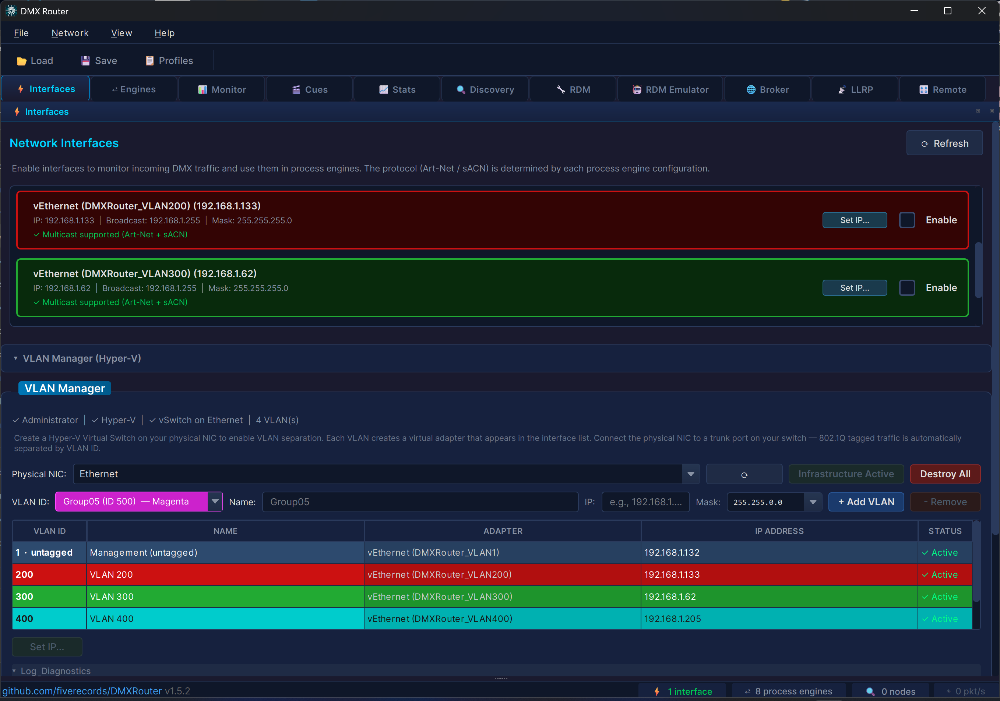
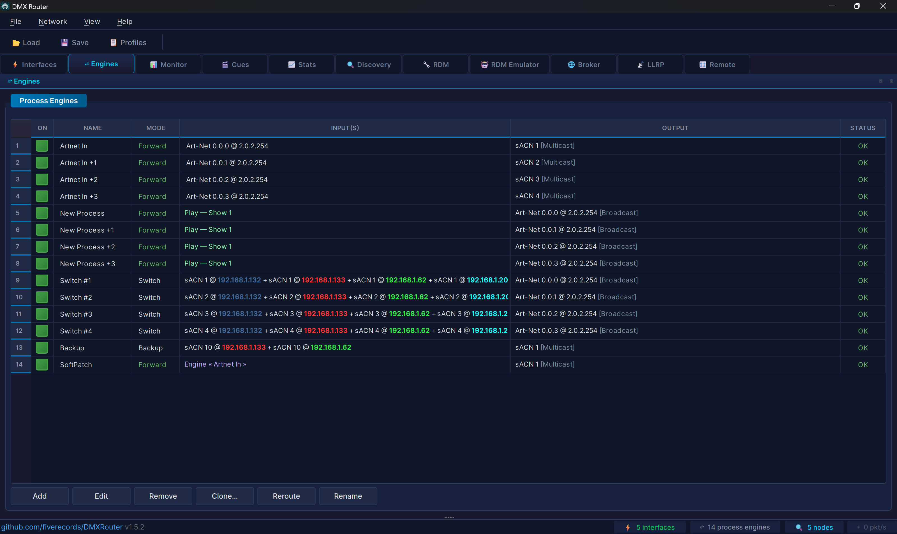
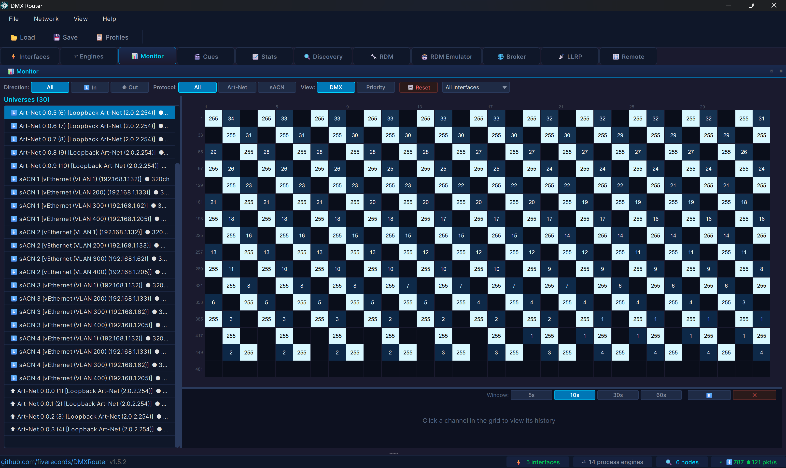
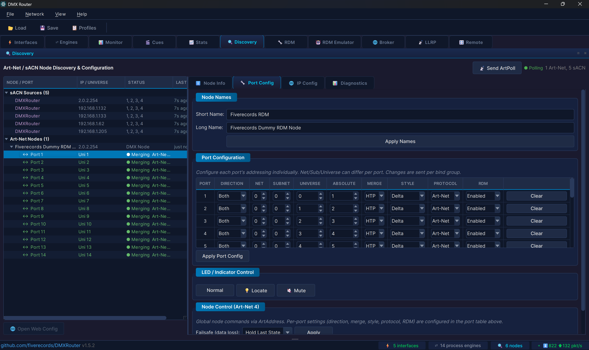

# DMXRouter

**Professional DMX512 lighting control router for live entertainment and architectural installations.**

DMXRouter is a high-performance, cross-platform application written in C++ with Qt6 that handles DMX512 data routing, merging, and show management across the major industry protocols. Designed for production environments where reliability and sub-millisecond timing are non-negotiable.

---



## Features at a Glance

- **Multi-protocol routing** — Art-Net 4, sACN (E1.31 2018), with full cross-protocol bridging
- **Internal routing** — cascade process engines for multi-stage merge topologies without physical loopback
- **Universe merge engine** — 8 merge modes including HTP, LTP, Backup, X-Fade, Switch, and Custom per-channel policy
- **sACN per-channel priority** — full E1.31 0xDD support in merge and monitoring, with color-coded priority visualization
- **Dockable panels** — all panels detach into floating windows for multi-monitor setups; drag, double-click, or use Alt+1–0
- **Show cue system** — snapshot and sequence recording, crossfade with selectable curves, autopilot auto-advance, loop/ping-pong playback, and DMX remote triggering
- **RDM device management** — full E1.20 with device discovery, parameter control, sensor monitoring, fixture templates with per-model DMX address assignment, operating hours tracking, and large installation support (100+ fixtures)
- **RDM device emulator** — capture a real fixture's RDM profile, create virtual fixtures from scratch, or edit existing profiles — impersonate them on the network for pre-programming, controller testing, or equipment replacement
- **RDMNet / LLRP** — E1.33 broker connection and LLRP device discovery
- **Channel-level patching** — per-channel remap, scale (0–200%), min/max limits, CSV import/export
- **Channel history** — oscilloscope-style real-time waveform display for any DMX channel
- **Network discovery** — live Art-Net node and sACN source discovery with protocol-aware remote node configuration
- **VLAN management** — cross-platform virtual adapter management for production network segmentation (Windows Hyper-V, Linux ip/8021q, macOS ifconfig)
- **Real-time statistics** — per-interface and per-universe throughput metrics with live event log and pop-out log window
- **Universe monitor** — real-time DMX data and sACN priority viewer with per-interface filtering for multi-NIC environments
- **Bulk workflow tools** — Reroute (swap interfaces across multiple engines at once), Rename with auto-increment, Absolute universe addressing across all panels
- **Profile manager** — save and recall complete configurations, with optional startup profile auto-load
- **Update checker** — automatic new version detection via GitHub Releases, with persistent status bar button and per-version dismiss
- **Cross-platform** — identical look and feel on Windows, Linux (x86-64 and ARM64), and macOS from a single codebase
- **~43,000 lines of production C++17** — zero compiler warnings with strict flags (`-Wall -Wextra -Wpedantic` / `/W4`)

---

## Table of Contents

- [Architecture](#architecture)
- [Protocol Support](#protocol-support)
- [Internal Routing](#internal-routing)
- [Merge Engine](#merge-engine)
- [Show Cue System](#show-cue-system)
- [RDM & RDMNet](#rdm--rdmnet)
- [RDM Device Emulator](#rdm-device-emulator)
- [Channel Patching](#channel-patching)
- [Channel History](#channel-history)
- [Network Discovery](#network-discovery)
- [VLAN Management](#vlan-management)
- [Statistics & Logging](#statistics--logging)
- [Universe Monitor](#universe-monitor)
- [User Interface](#user-interface)
- [Configuration](#configuration)
- [Typical Use Cases](#typical-use-cases)
- [Installation](#installation)
- [License](#license)

---

## Architecture

DMXRouter runs on a **single-threaded event-loop architecture** driven by Qt's event system. This is a deliberate design decision: crossfade calculations and merge operations complete in microseconds per tick even at high universe counts, while a multi-threaded worker queue would introduce latency through queued connections. The result is consistent sub-millisecond output timing — critical for live shows.

```
┌───────────────────────────────────────────────────────────┐
│                       Qt Event Loop                       │
├───────────────┬──────────────┬──────────────┬─────────────┤
│ UDPTransport  │ MergeEngine  │ ShowCueEngine│ DiscoveryMgr│
│ (Art-Net /    │ (8 modes,    │ (cue record/ │ (Art-Net /  │
│  sACN RX/TX)  │  512 routes) │  playback)   │  sACN scan) │
├───────────────┼──────────────┼──────────────┼─────────────┤
│ RDMManager    │ RDMNetManager│ PatchManager │ RdmEmulator │
│ (E1.20 RDM)   │ (E1.33/LLRP) │ (ch remap)   │ (virtual fx)│
├───────────────┴──────────────┴──────────────┴─────────────┤
│              Qt6 GUI (MainWindow + Widgets)               │
└───────────────────────────────────────────────────────────┘

```

Key design invariants:

- Per-universe sequence counters (Art-Net and sACN) — compliant with Art-Net 4 §ArtDmx and E1.31 §6.2.6
- Output rate limiter (token bucket at 44 fps / 22.7 ms) — prevents receiver overload per E1.31 §6.6.1, with dirty-flag optimization to skip identical frames and keep-alive emission every ~850 ms
- Socket send/receive buffers at 2 MB — absorbs burst traffic from 40+ simultaneous universes
- Packet rate calculations normalized by actual elapsed time — eliminates jitter from QTimer imprecision under event loop load
- Defensive bounds checking throughout — stale indices and corrupted fade states produce log warnings, never visible artifacts on a live rig

---

## Protocol Support

### Art-Net 4
- Receive and transmit ArtDmx on any local network interface
- ArtPoll / ArtPollReply discovery with manual trigger (no background polling traffic on production networks)
- Remote node configuration via ArtAddress and ArtIpProg
- Multi-bind node merging (combines replies from the same IP across ports)
- Correct per-universe sequence numbering (1–255, wrapping, independent per universe)
- Paced ArtAddress command queue (20 ms between packets) to prevent node RX buffer overflow on multi-port configurations
- ArtSync frame synchronization — buffers ArtDmx and releases on ArtSync for glitch-free output, with 4-second timeout fallback
- Correct broadcast routing on dual-NIC setups — packets go out on the correct interface instead of always using the system's default route

### sACN — ANSI E1.31 2018
- Full multicast and unicast support
- Per-universe per-source priority (0x64 default, 0xDD per-channel override fully supported in merge and monitoring)
- Per-channel priority 0 correctly handled — sources with priority 0 on a slot are excluded from the merge per E1.31 §6.2.3
- **Universe Synchronization** — E1.31 Extended Sync packets (vector 0x00000001) for glitch-free multi-universe refresh on LED walls and large installations
- Universe Discovery (10-second cycle with pagination)
- Stream termination handling
- Protocol-aware sequence validation (0 is a valid wrap value in sACN, unlike Art-Net where seq 0 means "disabled")
- Self-send detection via CID — prevents processing our own multicast packets on loopback

### Cross-protocol bridging
Any input protocol can be routed to any output protocol. Art-Net → sACN, sACN → Art-Net, or same-protocol universe remapping — all configurable per route.

---

## Internal Routing

The output of one process engine can be fed as the input to another, enabling cascading merge topologies without requiring physical network loopback.

- **Engine-to-engine selection** — the merge editor lists all available engines with their output targets; selecting one automatically links the routing
- **Per-engine sender keys** — each engine's internal output uses a unique cache key, preventing collisions when multiple engines share the same output universe
- **Keep-alive propagation** — when a source drops, the upstream engine's keep-alive data continues to feed downstream engines, preventing cascading failures through the routing chain
- **Failsafe hold propagation** — hold-last-state behaviour propagates correctly through internal routing chains, including Full and Scene failsafe modes which are now forwarded to downstream engines immediately
- **Physical loopback** — for same-interface routing scenarios where the "OWN" checkbox is enabled, data is injected directly without requiring an external network path
- **Recursion guard** — maximum depth of 4 prevents infinite loops in circular topologies

---

## Merge Engine



Each merge engine accepts **up to 4 inputs** and produces one merged output. Up to **512 engines** can run simultaneously.

### Merge Modes

| Mode | Description |
|------|-------------|
| **HTP** | Highest Takes Precedence — maximum value per channel across all inputs |
| **LTP** | Latest Takes Precedence — most recently updated source wins per channel |
| **Backup** | Primary input active; secondary takes over automatically when primary times out |
| **X-Fade** | Crossfade between two sources via a DMX control channel (0 = input 1, 255 = input 2) |
| **Switch** | Select one of up to 4 inputs via DMX control values (8–15 = input 1, 16–23 = input 2…) |
| **Custom** | Per-channel merge policy — each of the 512 channels independently set to Input1/2/3/4, HTP, or LTP |
| **sACN Priority** | Merges sources using E1.31 per-channel priority values; priority 0 excludes a source from the slot |
| **Preset / Snapshot** | Startup buffer that holds the last known state across power cycles |

### Per-engine Features

- **Master / Limit** — scale the entire output (0–100%) and set per-channel hard limits
- **Source IP filter** — accept data only from specific IP addresses
- **Accept Own Data** — control whether the engine processes packets from its own output interfaces
- **Accept Preview** — discard or accept sACN preview data packets (E1.31 bit 7)
- **Startup buffer** — send a stored snapshot while waiting for live sources to appear
- **Failsafe** — configurable behaviour when all sources time out: hold last, go to black, send full, or play a recorded scene
- **Channel patch** — per-channel remap applied after merge, before transmission
- **Enable / disable** — engines can be toggled on and off without losing their configuration

---

## Show Cue System

DMXRouter includes a complete show programming and playback engine for automated lighting control, supporting both instantaneous snapshots and time-based sequence recordings.

### Cue Types

**Snapshot** — captures the live merged DMX output across all active process engines as a single static frame. The classic cue type for theatrical and event lighting.

**Sequence** — records live DMX data over time at 40 fps (25 ms intervals, matching DMX refresh rate). Click ⏺ Rec to start recording while DMX is flowing, click again to stop. The result is a timeline cue that plays back the captured movement exactly as it happened — similar to a standalone DMX recorder, but integrated into the show system.

### Shows and Cue Management

- Up to **40 shows**, each with up to 999 cues
- Each cue stores per-engine DMX state (512 channels × engine count)
- Cues carry individual fade times, user labels, and recording timestamps
- **Copy** — copy selected cues within the same show or to a different one
- **Reorder** — move cues up or down in the list

### Playback

- **Go** — advance to the next cue with a smooth crossfade
- **Jump** — go to any cue by index
- **Back / Forward** — pre-select the next cue without triggering
- **Pause / Resume** — pause mid-crossfade or mid-sequence; resumes from exactly where it stopped
- **Stop** — halt playback and inject a blackout
- **Hold timer** — configurable auto-advance delay before the next cue fires

### Crossfade Engine

- 40 Hz update rate (25 ms tick) for smooth transitions
- Per-channel interpolation across all 512 channels of every active engine
- Flash-free cue jumps after a Stop state (skips the crossfade to prevent ghost-frame artifacts)
- When a crossfade starts from a playing sequence, DMXRouter snapshots the current frame and uses it as the fade source — no visual glitch from rewinding

### Fade Curves

Every cue has a selectable curve that shapes how the crossfade progresses:

| Curve | Behaviour |
|-------|-----------|
| **Linear** | Constant rate (default) |
| **S-Curve** | Smooth acceleration and deceleration (3t²−2t³) |
| **Ease In** | Starts slow, finishes fast |
| **Ease Out** | Starts fast, finishes slow |
| **Snap** | Instant jump at the midpoint of the fade time |

### Sequence Playback Modes

Each sequence cue has a Loop setting:

- **Once** — plays through the timeline once, then holds the last frame
- **Loop** — restarts from the beginning when it reaches the end
- **Ping-Pong** — reverses direction at each end, creating a back-and-forth effect

### Autopilot

When autopilot is enabled (✈ Auto), the engine automatically advances to the next cue after the current one finishes playing (including any hold time). Sequence cues respect the **Reps** column — the sequence plays the specified number of complete cycles before advancing. Playback stops at the end of the cue list.

### DMX Remote Control

- Any DMX channel on any universe can trigger snapshot take, sequence recording, play, stop, and cue selection from a lighting desk
- Arm / disarm prevents accidental triggers on startup
- Gap guard prevents cue flooding from noisy DMX faders

---

## RDM & RDMNet

### RDM — ANSI E1.20
- Discover devices on any Art-Net universe (ArtRdm packets)
- Identify, set DMX start address, device label, and personality
- **Identify management** — visual 💡 indicator and amber highlight in the device tree on identify, dedicated Identify Off button in the Config tab, right-click context menu (Identify On / Off), and an **All Identify Off** panic button in the header bar that sends Identify Off to every discovered fixture
- Read 19+ PIDs: device info, manufacturer, model, personality list, DMX address, identify state, sensor definitions and values, lamp state, lamp on mode, product detail, supported parameters, and more
- PID Browser for raw GET/SET of any standard or manufacturer-specific parameter
- 3-second transaction timeout with automatic retry (up to 2 retries per transaction)
- **Sequential probing** — fixtures are queried one at a time with 50 ms spacing, preventing gateway buffer overflow on cheap Art-Net nodes and cutting probe time from 9+ seconds to ~1.5 s on large rigs
- **ACK_TIMER** — fixtures that need extra time (factory reset, firmware) are retried after their requested delay, preserving the original command class (GET or SET)
- **ACK_OVERFLOW** — fixtures with 115+ supported PIDs that split responses across multiple packets are reassembled transparently
- **Full UTF-8 support** — manufacturer, model, label, software version, personality names, slot names, and sensor names display correctly in Chinese, Korean, and other non-Latin scripts
- Full device cache with parameter persistence
- **Personality column** — "Pers" column in the device tree shows the current mode (e.g., `3/12`) at a glance
- **DMX address overlap warning** — fixtures on the same port with overlapping channel ranges are highlighted in red with a conflict tooltip
- **Stale indicator tuned for scale** — 3-minute threshold prevents healthy fixtures from greying out on large installations where keepalive cycles exceed 60 seconds
- Interactive device tree in the **🔧 RDM** tab, sorted by DMX start address with device counts per port, DMX address ranges, and last-seen timestamps
- RDM is **off by default** — toggle on via toolbar to avoid unintended bus traffic during live shows

### Fixture Templates
- Save a device's configuration (DMX address, personality, label, and parameters) as a reusable template keyed by manufacturer and model ID
- **DMX address per model** — each template stores an optional DMX start address, editable directly in the template table. A global toggle — *Apply DMX address when using templates* — controls whether the address is sent to devices, making it easy to keep addresses configured but only activate them when needed (e.g., warehouse testing where every fixture of a model should start on the same channel)
- **Auto-apply on discovery** — newly discovered devices matching a saved manufacturer/model pair receive their template configuration automatically, enabling hands-free commissioning of replacement fixtures
- Templates stored as JSON and persist between sessions
- Manual apply available for selective deployment from the Templates tab

### Fixture Database
- Track operating hours, lamp hours, and power cycles for every RDM device in the installation
- Timestamped snapshots build a usage history per fixture for maintenance planning
- LED fixtures that don't support lamp hours no longer show misleading "0 hours" entries
- CSV export for integration with external asset management and maintenance scheduling tools
- Database cleanup to clear fixtures from previous sessions or venues
- Configurable minimum interval between snapshots to prevent redundant recordings

### RDMNet — ANSI E1.33 / LLRP
- **LLRP discovery** — multicast probe on 239.255.250.133 and 239.255.250.134 with known-UID suppression
- **RDM over LLRP** — send RDM commands to LLRP targets without an Art-Net path
- **Broker connection** — TCP with full Client Connect handshake, 15-second heartbeat, Client Fetch List, RPT Request/Notification/Status, and broker redirect (IPv4 and IPv6)
- CID-based packet filtering prevents processing responses intended for other controllers on the same network
- Corrupt TCP stream detection with immediate disconnect on invalid ACN headers
- Dedicated **🌐 RDMNet** tab with LLRP target list, broker controls, and client roster

---

## RDM Device Emulator

DMXRouter can impersonate RDM fixtures on the network — useful for pre-programming shows before hardware arrives, testing RDM controllers, or keeping console configurations stable when swapping equipment.

### Capture and emulate

Right-click any discovered device in the RDM tab and select **🤖 Capture for Emulation** to save its complete RDM identity: manufacturer, model, label, DMX footprint, personalities, slot map, and all supported parameters. In the **🤖 Emulator** tab, assign a virtual Art-Net port address and activate the profile. From that moment, DMXRouter announces the device via ArtTodData and responds to RDM queries exactly as the original fixture would.

### Create from scratch

Click **＋ Create New** to define a virtual fixture without needing a physical device on the network. The dialog lets you configure manufacturer, model, device label, software version, product category, multiple personalities with individual channel counts, and a full slot/channel map using standard E1.20 slot labels (Intensity, Red, Green, Blue, Pan, Tilt, Zoom, Gobo, Strobe, and more). The slot table auto-resizes to match the first personality's footprint and preserves descriptions when the channel count changes.

### Edit existing profiles

Click **✎ Edit** or use the right-click context menu to modify any profile — whether captured or manually created. The same dialog opens with all fields pre-filled. The UID, virtual port, active state, and any runtime changes made by controllers (DMX address, personality, label) are preserved.

### What controllers see

- Device appears in RDM discovery immediately — no manual TOD flush needed
- Responds to GET/SET for all standard PIDs: DEVICE_INFO, MANUFACTURER_LABEL, DEVICE_MODEL_DESCRIPTION, DEVICE_LABEL, SOFTWARE_VERSION_LABEL, SUPPORTED_PARAMETERS, DMX_START_ADDRESS, DMX_PERSONALITY, DEVICE_HOURS, DEVICE_POWER_CYCLES, slot descriptions, and more
- NACK with the correct reason code for unsupported PIDs
- Identify state can be toggled from the Emulator panel and is reflected in RDM responses
- DMX start address and personality changes made via RDM are applied immediately and persist

### Profile management

- **Duplicate** — clone a profile and assign it a new UID for emulating multiple units of the same fixture type
- **Export / Import** — save profiles as `.dmxrprofile` files to share between installations or build a library offline
- Each profile shows when it was captured, an optional user note, and the full personality and slot breakdown

### Technical details

- Emulated devices are advertised via ArtPollReply as additional bind indices, grouped by Net and Subnet per Art-Net spec
- Per-interface unicast receive sockets ensure correct RDM delivery when controller and emulator run on the same machine
- Emulated UIDs are filtered from incoming ArtTodData to prevent self-discovery loops
- Works with any Art-Net 4 controller; tested against DMXRouter's own RDM controller, dummyRDM, and real hardware gateways

---

## Channel Patching

Full channel-level remapping applied after merge and before output.

- **512-channel remap** — any input channel to any output channel
- **Scale** — multiply each channel value from 0% to 200%
- **Min / Max clamp** — hard floor and ceiling per channel
- **Bulk operations** — identity reset, channel offset, range map, pair swap, reverse, fan-out, dimmer curve
- **Presets** — save and recall patch configurations
- **CSV import / export** — compatible with standard patch sheets
- **Mini-map** — 32×16 visual overview of the complete 512-channel patch
- **Fixed-width table** — columns sized to fit numeric content with no horizontal scrolling

---

## Channel History



The universe monitor includes an **oscilloscope-style waveform display** for detailed channel-level analysis.

- **Step-style DMX trace** with gradient fill, matching the discrete nature of DMX values
- **Selectable time windows** — 5s, 10s, 30s, or 60s of history
- **Pause / resume** — freeze the view for inspection without losing incoming data
- **Hover crosshair** — shows exact value and timestamp at any point on the waveform
- **Min / max band** — dashed indicators show the value range over the visible window
- **30 FPS rendering** with smooth continuous scrolling
- **Sample deduplication** — stable channels consume minimal memory regardless of observation time

---

## Network Discovery



The **🔍 Discovery** tab shows all Art-Net nodes and sACN sources visible on the network in real time.

**Art-Net nodes:** short name, long name, firmware version, IP, port count, active universes. Remote configuration via ArtAddress and ArtIpProg directly from the UI. Dynamic port controls adapt to the actual port count reported by each node, with per-port universe display, merge mode, direction, RDM enable, output style, and protocol selection. Art-Net universes show absolute universe numbers alongside the standard Net.Subnet.Universe notation. Nodes removed 60 seconds after last reply.

**Protocol-aware port configuration** — switching a port between Art-Net and sACN adapts the addressing UI automatically: sACN hides Net/Subnet and expands Universe to 1–32,767, Art-Net shows the traditional Net / Subnet / Universe fields with a fully editable Absolute column that auto-syncs with the individual address fields. Switching preserves the displayed universe number — no manual recalculation needed.

**sACN sources:** source name, CID, IP, universe list. Sources removed 15 seconds after last packet.

**Node configuration** includes failsafe mode control (hold last state, all off, all full, playback scene, record scene) with intelligent detection of node capabilities — commands are sent even when nodes don't advertise support, with a clear tooltip advisory.

ArtPoll is **manually triggered** via toolbar button to avoid continuous background traffic on production networks.

---

## VLAN Management

DMXRouter provides cross-platform virtual network adapter management for production network segmentation.

### Windows (Hyper-V)
- Create / destroy Hyper-V Virtual Switch via asynchronous PowerShell
- Add and remove VLANs with configurable IDs and names
- Colour-coded VLAN table
- Adapter filtering hides system adapters (Default Switch, management NICs)
- Network diagnostics panel
- Requires: Windows administrator privileges and Hyper-V feature enabled

### Linux
- VLAN creation via `ip link` with 802.1Q tagging (`8021q` kernel module)
- IP address assignment and interface lifecycle management
- POSIX-compatible commands (no GNU-only dependencies)

### macOS
- VLAN creation via `ifconfig` with BSD-native `vlan` interface naming
- Automatic NIC configuration and IP assignment

> On all platforms, WiFi adapters, VPN tunnels, Docker bridges, and other non-Ethernet interfaces are filtered from the interface list. A clear advisory guides the user when prerequisites are not met.

---

## Statistics & Logging

The **📈 Stats & Log** tab provides live operational visibility.

**Metrics dashboard** — 8 live cards: Packets In/s, Packets Out/s, Total In, Total Out, Active Universes, Error Count, Sequence Errors, Uptime. Colour-coded green / red / grey by state. Packet rates are normalized by actual elapsed time to eliminate jitter under load.

**Throughput chart** — rolling 2-minute history (120 snapshots), rendered with QPainter. Cyan for inbound, green for outbound, semi-transparent fill, auto-scaling Y axis with smooth decay to prevent visual jumps on scale changes.

**Per-interface breakdown** — packet counts, Art-Net / sACN protocol split, error totals.

**Per-universe breakdown** — packet rates, merge operation counts, sequence errors, last-seen timestamp.

**Event log** — ring buffer of 10,000 entries, thread-safe. Captures all `qDebug` / `qInfo` / `qWarning` / `qCritical` output. Automatic category tagging (ArtNet, sACN, Transport, Merge, Discovery, Network, System). Filterable by level and category. Auto-scroll toggle, Clear button, monospace font. **Pop-out button** detaches the log into its own window — filters, auto-scroll, and live entries keep working while floating; close or click Dock to snap it back.

---

## Universe Monitor

The **📊 Monitor** tab provides a real-time view of all DMX data flowing through the system.

- **Per-interface filtering** — dropdown populated dynamically as interfaces appear, allowing inspection of specific network paths when the same universe arrives on multiple NICs or VLANs
- **Direction filter** — isolate input-only or output-only traffic
- **Protocol filter** — view Art-Net, sACN, or both
- **DMX / Priority view toggle** — switch between standard DMX levels (0–255) and sACN per-channel priority data (0xDD start code). Priority view uses a dedicated color palette: blue (low) → green (default 100) → orange/red (high/max 200). Hover shows the exact priority value and level label
- **Priority indicators** — universe list entries carrying 0xDD data show a `[P]` tag; when multiple sources disagree on priority, both values are shown (e.g., `pri:100/150`)
- **Grid view** — 32×16 channel grid with colour-coded values and amber selection highlight
- **Absolute universe display** — Art-Net universes show `0.1.0 (17)` with 1-based absolute numbering
- **Active channel count** — shows how many channels are above zero
- **Channel history** — click any channel to open the oscilloscope waveform view
- **VLAN-friendly naming** — long adapter names like `DMXRouter_VLAN200` are automatically abbreviated to `VLAN 200` for readability

---

## User Interface

### Dockable Panels
All panels (Interfaces, Engines, Monitor, Cues, Stats, Discovery, RDM, RDM Emulator, Broker, LLRP, Remote Control) can be **detached into floating windows** — double-click any tab or drag it out. Ideal for multi-monitor setups: put the Monitor on your FOH screen, Engines on the tech desk, RDM on a tablet. Closing a floating panel snaps it back into the main window — panels are never lost. Keyboard shortcuts work regardless of docked or floating state.

### Bulk Workflow Tools
- **Reroute** — when a network interface changes IP, select the affected engines, click Reroute, and a From → To dialog swaps one interface for another across all selected engines at once (inputs, outputs, and control channels). Single-selection mode shows a per-slot detail view for fine-tuning.
- **Rename with auto-increment** — select several engines, click Rename, enter a base name ending in a number (e.g., "Stage 1"), and they are named Stage 1, Stage 2, Stage 3 in selection order.
- **Absolute universe field** — all control source panels (Remote Control, Show Cue, merge editor) include an Absolute field (Art-Net PA+1). Editing Absolute updates Net/Subnet/Universe and vice versa; switching between Art-Net and sACN preserves the universe address.

### Cross-Platform Visual Consistency
The interface looks identical on Windows, macOS, and Linux — same font (Inter), same colors, same spacing. Platform-specific adaptations happen under the hood:

- **Windows** — FreeType font engine eliminates the colored ClearType fringing on dark backgrounds
- **macOS** — stylesheet font sizes scaled for Retina displays; native file dialogs restored for Sequoia compatibility; App Nap disabled so DMX output stays active when the window loses focus; correct system monospace font (Menlo) used in all technical readouts
- **Linux** — consistent Fusion style with bundled Inter font; system monospace font (DejaVu Sans Mono) for technical readouts

---

## Configuration

All settings are saved to a single JSON file via **File → Save Config** (Ctrl+S) and restored with **File → Load Config** (Ctrl+O). The file includes: routing table, merge engine configurations, channel patches, show cues, VLAN settings, discovery preferences, and application version. The application tracks unsaved changes and prompts on close.

**Profile Manager** allows saving named snapshots of the complete configuration for quick recall during productions. Up to 40 profiles stored on disk. A profile can be pinned as **⭐ Startup Profile** to load automatically on launch instead of the last session.

**Session persistence** — enabled network interfaces, VLANs, and cue recorder state are saved independently of process engines and restored on every launch, even with no engines configured.

**Update checker** — automatically checks GitHub for new releases at startup (with a 3-second delay). When a new version is available, a persistent orange button appears in the status bar; clicking it opens a dialog where you can download the update, dismiss it for later, or ignore that specific version permanently. Manual check available in the Help menu. Platform-specific asset detection for direct download links.

Example configuration excerpt:

```json
{
  "merges": [
    {
      "name": "FOH Merge",
      "output": { "protocol": "sacn", "universe": 1 },
      "mode": "htp",
      "inputs": [
        {
          "source": { "protocol": "artnet", "net": 0, "subnet": 0, "universe": 0 },
          "interface": "eth0:10.0.0.1",
          "priority": 100
        }
      ],
      "master": 100,
      "failsafe": "hold"
    }
  ]
}
```

---

## Typical Use Cases

**Protocol bridge** — receive Art-Net from a console on one NIC, output sACN to fixtures on another, or the reverse. Each interface is independently addressed.

**Console merge** — two FOH consoles sending to the same universe, merged via HTP so the highest value from either wins at all times.

**Priority backup failover** — main console at sACN priority 200, backup at 100. If the main drops, the backup takes over automatically within the source timeout window. The priority monitor shows exactly which source is winning each channel and why.

**X-Fade / media server handoff** — crossfade between a lighting desk and a media server output using a single DMX fader as the blend control.

**Multi-stage processing** — chain process engines using internal routing: first engine merges two consoles via HTP, second engine crossfades the result with a media server, third engine applies a master dimmer. No physical loopback required.

**Show automation** — record snapshot cues during rehearsal and play them back during the performance with configurable crossfade times and fade curves. Record DMX sequences for time-based effects (moving lights, color chases) and use autopilot to run self-advancing shows unattended. Trigger everything manually, on a timer, or from a DMX control channel on the desk.

**Pre-programming with the RDM emulator** — capture profiles from existing fixtures or create virtual fixtures from scratch, then emulate them on a different site or machine. The console discovers and patches the virtual fixtures as if the real hardware were connected, so show files are ready before the truck arrives.

**Fixture repatching** — remap RGB → BGR for fixtures wired in a non-standard order, or offset a dimmer rack that starts at an unusual DMX address, without touching the console patch.

**Network segmentation** — receive on a production VLAN, output on a separate lighting VLAN, using DMXRouter as the bridge between segments. Cross-platform VLAN management makes this possible on Windows, Linux, and macOS.

**Large LED installation** — use sACN Universe Synchronization to ensure all universes are released simultaneously at receiver endpoints, eliminating visible tearing across a multi-universe LED wall.

**Fixture fleet management** — use RDM fixture templates to pre-configure replacement fixtures automatically on discovery, and track operating hours across the entire installation for proactive lamp and LED driver maintenance scheduling. The personality column and DMX overlap warnings catch configuration errors before they reach the stage.

**Warehouse testing** — assign a fixed DMX address per fixture model in the template table, enable the "Apply DMX address" toggle, and every fixture of that type gets addressed automatically on RDM discovery — no manual addressing needed for quick bench tests.

**Multi-monitor control** — detach the Universe Monitor onto the FOH screen, keep the Engines panel on the tech desk, and float the RDM panel on a tablet — all running from a single DMXRouter instance.

---

## Installation

### Windows
Download and run `DMXRouter-Setup.exe`. All dependencies are included.

### Linux
Download the binary for your architecture from the [Releases](https://github.com/fiverecords/DMXRouter/releases) page:
- `DMXRouter-v1.5.2-linux-x86_64.zip` — standard PCs and servers
- `DMXRouter-v1.5.2-linux-arm64.zip` — Raspberry Pi 4/5, Orange Pi, and other ARM64 boards

Qt6 runtime libraries are required:

```bash
# Ubuntu / Debian / Raspberry Pi OS
sudo apt install libqt6core6 libqt6gui6 libqt6widgets6 libqt6network6

# Fedora
sudo dnf install qt6-qtbase

# Arch
sudo pacman -S qt6-base
```

Then run:
```bash
chmod +x DMXRouter
./DMXRouter
```

VLAN management requires root privileges (`sudo ./DMXRouter`) and the `vlan` kernel module (`sudo modprobe 8021q`).

### macOS
Download the `.app` bundle from the [Releases](https://github.com/fiverecords/DMXRouter/releases) page. Qt6 frameworks are bundled inside the application. Requires macOS 12.0 (Monterey) or later. On first launch you may need to allow it in System Settings → Privacy & Security.

---

## License

Copyright (c) 2026. All rights reserved.

This software is proprietary. See the [LICENSE](LICENSE) file for full terms.

This application uses **Qt 6**, licensed under the LGPL v3. Qt is dynamically linked and unmodified. See the [NOTICE](NOTICE) file for third-party attributions and your rights under the LGPL.

---

*DMXRouter v1.5.2 — Built for the stage.*
