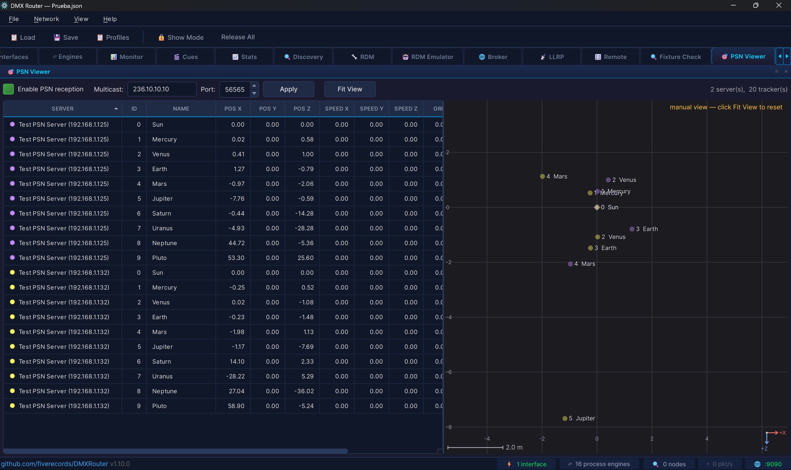

# DMXRouter

[](https://github.com/fiverecords/DMXRouter/releases/latest)
[](https://github.com/fiverecords/DMXRouter/releases/latest)
[](https://github.com/fiverecords/DMXRouter/releases)
[](https://github.com/fiverecords/DMXRouter/releases)
[](https://en.cppreference.com/w/cpp/20)
[](https://www.qt.io/)
[](LICENSE)

**Professional DMX512 lighting control router for live entertainment and architectural installations.**

DMXRouter is a high-performance, cross-platform application written in C++ with Qt6 that handles DMX512 data routing, merging, and show management across the major industry protocols. Designed for production environments where reliability and sub-millisecond timing are non-negotiable.

---


## Features at a Glance

- **Multi-protocol routing** — Art-Net 4, sACN (E1.31 2018), with full cross-protocol bridging
- **MIDI / OSC bridge** — any process engine output can emit OSC (UDP, configurable address scheme, int or float value format, optional per-channel custom mapping table) or MIDI (Control Change or Note On/Off, with channel + first-CC or first-note + velocity mode + trigger threshold) instead of DMX, routing merged channel data to TouchOSC, QLab, Reaper, Ableton Live, Resolume, samplers, video loopers, DAWs with a virtual MIDI port, or any custom integration — alongside or instead of Art-Net / sACN. Symmetric input-side bridge accepts OSC or MIDI from an external source and feeds it into the merge engine as if it were a DMX source. USB MIDI ports and virtual ports (loopMIDI, IAC bus, snd-virmidi) reconnect automatically when unplugged mid-session or created after launch
- **Internal routing** — cascade process engines for multi-stage merge topologies without physical loopback
- **Universe merge engine** — 8 merge modes including HTP, LTP, Backup, X-Fade, Switch, and Custom per-channel policy. Per-engine failsafe behaviour (Hold Last State, Blackout, Full On, Playback Scene, or Stop Output entirely so a lower-priority sACN source on the same universe takes over) when every input is lost. Per-output transmit delay (0–5000 ms) for aligning a real rig with a visualizer's pipeline latency or syncing DMX with a buffered audio playback system, with zero overhead when off
- **sACN per-channel priority** — full E1.31 0xDD support in merge and monitoring, with color-coded priority visualization
- **Dockable panels** — all panels detach into floating windows for multi-monitor setups; drag, double-click, or use Alt+1–0
- **Show cue system** — snapshot and sequence recording, crossfade with selectable curves, autopilot auto-advance, loop/ping-pong playback, DMX remote triggering, and per-show import/export
- **RDM device management** — full E1.20 with device discovery, parameter control, sensor monitoring, self-test discovery and triggering, fixture templates with per-model DMX address assignment, operating hours tracking, Fixture ID (E1.37-5), manufacturer PID browser with per-device value caching, automatic status message drain, customizable device tree columns (including Serial and Rental ID from the Fixture Database), preset scene management (E1.37-1 PRESET_INFO / PRESET_STATUS / CAPTURE_PRESET with inline editing of fade times), large installation support (100+ fixtures), instant reconnect after brief disconnects (cached static info skips the full PID re-fetch sweep), optional quick-select mode that skips advanced PIDs for fast channel/personality changes, "Set Address From Patch" right-click action that pushes a fixture's MVR address straight to the device via SET_DMX_START_ADDRESS, Thorough Discovery (multi-pass discovery with configurable settling time) for older Art-Net gateways and lossy switching where a single discovery sweep returns fewer fixtures than are actually patched, and Export to CSV / clipboard (TSV) for cross-checking the discovered device list between machines on the same rig — useful when collisions inside RDM's 3-second response window cause one machine to see fixtures the other missed
- **RDM device emulator** — deep-capture a real fixture's complete RDM identity (every supported PID response stored verbatim), create virtual fixtures from scratch, or edit existing profiles — impersonate them on the network for pre-programming, controller testing, or equipment replacement. Save as reusable templates with full PID data preserved
- **RDMNet / LLRP** — E1.33 broker connection, LLRP device discovery with network recovery (E1.37-2), and identify management
- **Show Mode** — live-show protection lock that blocks destructive and caution-level operations across the desktop GUI, web interface, and REST API while keeping playback fully available
- **Channel-level patching** — per-channel remap, scale (0–200%), min/max limits, CSV import/export
- **Channel history** — oscilloscope-style real-time waveform display for any DMX channel
- **Network discovery** — live Art-Net node and sACN source discovery with protocol-aware remote node configuration. Optional WiFi interface support for preprogramming scenarios without Ethernet. Passive MA-Net listener detects grandMA2 and grandMA3 stations on the wire (hostname, session name, IP, protocol) so an operator running a mixed rig can see at a glance which MA gear is alive, without needing a separate tool
- **VLAN management** — cross-platform virtual adapter management for production network segmentation (Windows Hyper-V, Linux NetworkManager, macOS networksetup). Industry-standard group presets with colour-coded dropdown, plus a Custom entry for any VLAN ID (1–4094). No need to run as root — each platform prompts for the admin password only when needed. VLANs and IPs persist across reboots on all three platforms.
- **Real-time statistics** — per-interface and per-universe throughput metrics with live event log and pop-out log window
- **Universe monitor** — real-time DMX data and sACN priority viewer with per-interface filtering for multi-NIC environments, plus a per-cell channel-label band that abbreviates the GDTF or MA2 attribute name above each value (Pan, Dim, R/G/B, Zoom, Iris, Strobe, Focus, …) so the operator can identify what each channel does without leaving the monitor
- **PSN viewer** — passive PosiStageNet receiver and visualiser for tracking-server traffic (Spotme, BlackTrax, Zactrack, MA Stage Marker streams, etc.). Multi-server support, sortable table with server-coloured swatches, interactive 2D top-down map with mouse-wheel zoom, drag-pan, and Fit View. Click a row to highlight the corresponding tracker on the map. Fixture-to-tracker binding ties patched fixtures to PSN trackers so the viewer can show which lights are aimed at which moving target — a Followers column counts the fixtures bound to each tracker, a Selected tracker detail panel surfaces the v2.03 fields (acceleration, target position, per-tracker timestamp, server compute lag) and the bound fixture list, and the map draws connecting lines from each follower fixture's stage position to its tracker dot. Receive-only — DMXRouter never emits PSN, so it's safe to drop onto a live tracking network as a passive observer
- **Manual test patterns** — per-engine "Test…" button (toolbar + right-click) opens a non-modal dialog that injects Full / Blackout / Ramp (Up or Down direction, Synchronous or Rolling style) / Chase (with optional Hold-until-loop fill) / Sinewave (Synchronous or Rolling) / Single Channel patterns onto an engine's outputs while troubleshooting. Bypasses channel patch and fixture overrides — what hits the wire is exactly the pattern. Works on silent engines too (data loss / Stop failsafe / never-received-input — DMXRouter feeds the pattern at ~30 Hz on its own). Live pattern switching with phase-preserving speed control (drag the slider while a pattern runs and the wave's current position holds steady while its forward speed shifts), continuous speed range from 100 ms strobe-fast to 30 s slow walk, configurable Chase group size (1–16, set to 3 for RGB pixel strips, 4 for RGBW) and rolling-wave wavelength (3–512 channels, shared by rolling Ramp and rolling Sinewave), selectable duration with a 5-minute hard ceiling, multi-engine simultaneous testing, live "TEST 23s" countdown badge in the engine row, auto-stop on dialog close / engine edit / profile load. Inspired by sACNView's Transmit Window and ChamSys MagicQ's per-universe Test button
- **Bulk Snapshot dialog** — toolbar "Snapshot…" button + right-click entry opens a dialog that captures startup buffers and records failsafe scenes across many selected engines in one sweep instead of one editor session per engine. Capture pulls each checked engine's live merged output into its own startup buffer or failsafe scene; Import broadcasts a single .dmx/.bin file to every checked engine. Live annotations on each row show what's already stored ("startup ✓", "failsafe ✓") before and after each operation, so silent skips (e.g. an engine that hasn't produced output yet) are visible at a glance. Each operation is its own undo step. Show Mode "Destructive" gated
- **Bulk workflow tools** — Reroute (swap interfaces across multiple engines at once), Rename with auto-increment, Uni −/+ quick universe adjust for all engine modes, Engine Templates for rapid setup, Absolute universe addressing across all panels
- **Engine groups** — organize process engines into collapsible, color-coded groups with drag-free reordering (Move Up/Down), tristate enable/disable, custom display order, and full profile persistence. Groups appear above ungrouped engines like folders before files
- **Profile manager** — save and recall complete configurations, profile preview before loading, preserve IP/VLAN option on recall, import/export profiles between machines, optional startup profile auto-load, periodic auto-save with crash recovery dialog on startup. VLAN restore automatically scans the OS, imports existing adapters, creates missing ones (including vSwitch infrastructure on Windows), and applies saved IP addresses — auto-picks the saved parent NIC when it is still present on the host (kiosk-friendly silent boot) and only prompts for adapter selection when the saved one is no longer available
- **Auto-launch on OS startup** — optional File-menu toggle to start DMXRouter automatically when the user logs in. Cross-platform: registers a per-user entry on Windows (HKCU Run key), Linux (XDG `~/.config/autostart` desktop file), and macOS (LaunchAgent plist). No admin/sudo required to toggle. Pairs with "Auto-restore last config on startup" for unattended installation rigs that boot straight into the running profile
- **Update checker** — automatic new version detection via GitHub Releases, with persistent status bar button and per-version dismiss
- **Web remote control** — built-in HTTP + WebSocket server with a responsive web interface. Full engine management (create, edit, delete, enable/disable, switch inputs, Output Processing block with Master/Limit, Startup Buffer and Failsafe controls), Fixture Check panel for live commissioning from a tablet (semantic sliders, Highlight, walk-the-rig with Auto-Next stepping that stays in sync between desktop and tablet, sort by Address/FID/Name, RDM cross-reference, "Set Address From Patch" on every RDM device row), RDM device configuration and template management (edit, delete, plus global Auto-apply / Apply DMX address / Alert identify toggles), LLRP discovery and network recovery (E1.37-2), VLAN management, IP editor, universe monitor with live DMX grid, per-universe stats, show control, and profile management from any phone, tablet, or browser on the network. Optional PIN authentication, PWA support (add to home screen), keyboard shortcuts, zero external dependencies
- **Fixture Check** — commissioning dock for walking through an imported rig fixture-by-fixture. Import `.mvr` files from MA3, Capture, Vectorworks, WYSIWYG and others; match placeholders to real GDTF profiles via built-in gdtf-share.com client; control fixtures with semantic sliders (Pan/Tilt/Color/Gobo/…), Home/Highlight/Release, multi-fixture broadcast, named channel ranges with wheel thumbnails, multi-cell LED wall support. Walk-the-rig with multi-selection, Auto-Next stepping on a configurable timer, and Prev / Next that follow the patch tree's column sort (FID, Address, Name, Mode). Click any column header to sort within layer groups. Integrates with RDM: right-click any discovered device to inject it into the patch even without an MVR. Per-instance Change Mode (right-click any patch tree row to switch one or more fixtures to a different mode of their assigned GDTF without re-running the resolver), Change Fixture ID (rename a single fixture or renumber a whole selection consecutively from a starting value), and DMX address overlap highlighting (red tint with tooltip listing the offending neighbours, same convention as the RDM device tree) catch the two most common patch-time errors. PSN tracker binding (right-click "Follow PSN Tracker…") ties patched fixtures to live PSN trackers — a dedicated PSN column in the tree shows the bound tracker ID per fixture, and the PSN viewer reflects the relationship in its Followers column, detail panel, and connecting lines on the map. **Export MVR** writes the current patch back out to a `.mvr` archive — including any non-fixture scene content (trusses, scene objects, focus points) that was carried in from the original import, plus the operator's edits — for consoles, previz, and 3D-visualisation tools downstream. Optional one-gesture push to MVR-xchange peers in the same dialog.
- **MVR-xchange network** — discover other MVR-xchange capable applications on the LAN (grandMA3, Vectorworks Spotlight, BlenderDMX, Production Assist, Zactrack) and pull their currently-loaded MVR directly into the patch without a USB stick; advertise the loaded MVR back so a downstream peer can chain (Vectorworks → DMXRouter → another DMXRouter or visualiser). Single-page dialog with one **Activate MVR-Exchange** toggle for both discovery and sharing, **Interface** selector for choosing which NIC to advertise on (defaults to all NICs including loopback so a peer on the same workstation works out of the box), identity (Station name, Group, persistent Station UUID) editable per-machine, real-time **transaction log** showing every protocol event, automatic `MVR_COMMIT` push to connected peers when the loaded MVR changes, automatic service stop after a successful receive so DMXRouter doesn't keep advertising in the background after the operator has moved on to import. Also serves as the publishing channel for **Export MVR** from Fixture Check — a checkbox in the export dialog pushes the freshly-built archive to joined peers in the same gesture as the file write.
- **Cross-platform** — identical look and feel on Windows, Linux (x86-64 and ARM64), and macOS from a single codebase
- **~137,000 lines of production C++20** — zero compiler warnings with strict flags (`-Wall -Wextra -Wpedantic` / `/W4`)

---

## Table of Contents

- [Architecture](#architecture)
- [Protocol Support](#protocol-support)
- [Internal Routing](#internal-routing)
- [Merge Engine](#merge-engine)
- [Show Cue System](#show-cue-system)
- [RDM & RDMNet](#rdm--rdmnet)
- [RDM Device Emulator](#rdm-device-emulator)
- [Fixture Check](#fixture-check)
- [MVR-xchange Network](#mvr-xchange-network)
- [Channel Patching](#channel-patching)
- [Channel History](#channel-history)
- [Network Discovery](#network-discovery)
- [VLAN Management](#vlan-management)
- [Statistics & Logging](#statistics--logging)
- [Universe Monitor](#universe-monitor)
- [PSN Viewer](#psn-viewer)
- [User Interface](#user-interface)
- [Configuration](#configuration)
- [Web Remote Control](#web-remote-control)
- [Typical Use Cases](#typical-use-cases)
- [Installation](#installation)
- [License](#license)

---

## Architecture

DMXRouter runs on a **single-threaded event-loop architecture** driven by Qt's event system. This is a deliberate design decision: crossfade calculations and merge operations complete in microseconds per tick even at high universe counts, while a multi-threaded worker queue would introduce latency through queued connections. The result is consistent sub-millisecond output timing — critical for live shows.

```
┌───────────────────────────────────────────────────────────┐
│                       Qt Event Loop                       │
├───────────────┬──────────────┬──────────────┬─────────────┤
│ UDPTransport  │ MergeEngine  │ ShowCueEngine│ DiscoveryMgr│
│ (Art-Net /    │ (8 modes,    │ (cue record/ │ (Art-Net /  │
│  sACN RX/TX)  │  512 routes) │  playback)   │  sACN scan) │
├───────────────┼──────────────┼──────────────┼─────────────┤
│ RDMManager    │ RDMNetManager│ PatchManager │ RdmEmulator │
│ (E1.20 RDM)   │ (E1.33/LLRP) │ (ch remap)   │ (virtual fx)│
├───────────────┼──────────────┴──────────────┴─────────────┤
│ WebServer     │          Qt6 GUI (MainWindow + Widgets)   │
│ (HTTP + WS)   │                                           │
└───────────────┴───────────────────────────────────────────┘

```

Key design invariants:

- Per-universe sequence counters (Art-Net and sACN) — compliant with Art-Net 4 §ArtDmx and E1.31 §6.2.6
- Output rate limiter (token bucket at 44 fps / 22.7 ms) — prevents receiver overload per E1.31 §6.6.1, with dirty-flag optimization to skip identical frames and keep-alive emission every ~850 ms
- Socket send/receive buffers at 2 MB — absorbs burst traffic from 40+ simultaneous universes
- Packet rate calculations normalized by actual elapsed time — eliminates jitter from QTimer imprecision under event loop load
- Defensive bounds checking throughout — stale indices and corrupted fade states produce log warnings, never visible artifacts on a live rig

---

## Protocol Support

### Art-Net 4
- Receive and transmit ArtDmx on any local network interface
- ArtPoll / ArtPollReply discovery with manual trigger (no background polling traffic on production networks)
- **Static node entries** — add Art-Net nodes by IP for cross-subnet discovery. ArtPoll is sent unicast to each static node so they appear in the Discovery tab even when broadcast can't reach them. Persistent across sessions. Cross-subnet discovery depends on the node and network configuration — the node must reply with unicast and have a gateway configured
- Remote node configuration via ArtAddress and ArtIpProg
- Multi-bind node merging (combines replies from the same IP across ports)
- Correct per-universe sequence numbering (1–255, wrapping, independent per universe)
- Paced ArtAddress command queue (20 ms between packets) to prevent node RX buffer overflow on multi-port configurations
- ArtSync frame synchronization — buffers ArtDmx and releases on ArtSync for glitch-free output, with 4-second timeout fallback
- Correct broadcast routing on dual-NIC setups — packets go out on the correct interface instead of always using the system's default route

### sACN — ANSI E1.31 2018
- Full multicast and unicast support
- **Cross-subnet multicast reception** — sACN packets are accepted regardless of whether the host's NIC shares an IP range with the senders. Standard multicast routing through IGMP-snooping switches works as the protocol intends; the kernel's multicast group membership filters which packets reach DMXRouter, no second-guessing by source-IP arithmetic in software. Operators with a host on (for example) `10.0.x.x/24` and lighting controllers on `192.168.x.x/16` no longer have to retag the host's NIC to match the source range
- Per-universe per-source priority (0x64 default, 0xDD per-channel override fully supported in merge and monitoring)
- Per-channel priority 0 correctly handled — sources with priority 0 on a slot are excluded from the merge per E1.31 §6.2.3
- **Universe Synchronization** — E1.31 Extended Sync packets (vector 0x00000001) for glitch-free multi-universe refresh on LED walls and large installations
- **Configurable monitor range** — by default, universes 1–1024 are joined for multicast reception so incoming sACN traffic is visible immediately in the monitor and available for routing. Adjustable via a spinner in the Monitor tab toolbar (0–63999). Universes required by process engine inputs are always joined regardless of this setting
- Universe Discovery (10-second cycle with pagination)
- Stream termination handling
- Protocol-aware sequence validation (0 is a valid wrap value in sACN, unlike Art-Net where seq 0 means "disabled")
- Self-send detection via CID — prevents processing our own multicast packets on loopback

### Cross-protocol bridging
Any input protocol can be routed to any output protocol. Art-Net → sACN, sACN → Art-Net, or same-protocol universe remapping — all configurable per route.

### OSC output
- Per-output destination host + UDP port (default 9000)
- Configurable address scheme with `{u}` and `{c}` placeholders for universe and channel — default `/dmx/u{u}/c{c}` produces `/dmx/u1/c47` for universe 1 channel 47
- Two value formats: 32-bit big-endian integer 0–255 for receivers that want raw DMX, or 32-bit big-endian float 0.0–1.0 for audio-domain receivers that expect normalised values
- **Custom per-channel mapping** — for receivers that need different addresses per channel (Resolume's `/composition/layers/1/opacity` alongside `/composition/columns/3/connect`, QLab cues at distinct paths), the template can be replaced with a five-column table where each row maps one DMX channel to one OSC address with one of six modes: Pass int / Pass float forward the live value as 0–255 int or 0–1 float on every change; Fixed int / Fixed float send a configured constant whenever the source channel changes; Trigger int / Trigger float send the configured constant only when the source rises through a threshold (no event on the falling edge — the analogue of MIDI Note On without an explicit Note Off, suited to Resolume clip-launch and QLab GO triggers). The same source channel can appear in multiple rows so a single fader can fan out to several addresses. Import / Export buttons read and write the mapping list to a standalone JSON file independent of DMXRouter profiles, useful for sharing a Resolume or QLab address library between rigs
- Per-frame diff: only channels whose value changed since the last frame are emitted, so a static rig produces no packets and a single fader move produces a single OSC message per affected channel

### MIDI output
- Per-output port selector populated from the host's native MIDI subsystem (Windows MM, CoreMIDI on macOS, ALSA on Linux) — virtual ports via loopMIDI / IAC bus / snd-virmidi appear automatically
- MIDI channel 1–16
- **Control Change** mode: linear DMX-channel-to-CC mapping at 7-bit precision (DMX 0–255 right-shifted to MIDI 0–127), one CC per DMX channel starting from a configurable first CC, channels beyond CC 127 silently dropped. Suitable for MIDI mixers, DAW plugin automation, and any receiver expecting continuous value streams
- **Note On/Off** mode: each DMX channel maps to a MIDI note starting from a configurable first note (default 60 = middle C), with a configurable trigger threshold (default 1) and selectable velocity mode (proportional to DMX value at the crossing moment, or a configurable fixed velocity). One Note On per rising threshold crossing, one Note Off when the value falls back below — no retrigger while held. Suitable for samplers, video loopers, and lighting consoles that take MIDI Note as cue triggers
- Explicit cleanup: removing an output, changing its port / channel / message type, or shutting down DMXRouter sends All Sound Off (CC 120) on the affected channel before reconfiguring, so receivers don't get stranded with held notes
- Built on libremidi (Jean-Michaël Celerier and contributors)

### OSC input
- A process engine input can be configured to receive OSC from an external source (TouchOSC, Lemur, a custom controller, a DAW with OSC output) and feed it into the merge engine on the input's universe as if it were a DMX source — every merge mode, failsafe path, test pattern, and fixture override layer applies identically to network DMX
- UDP listener bound to a configurable port (default 9000) and interface (default all NICs, with "Localhost only" and named NICs for multi-network rigs)
- Path-scheme template with `{c}` for DMX channel extraction and optional `{u}` for universe filtering so multiple OSC sources can share one listener
- Value-decoding selector: Auto reads the OSC typetag (`,i` as 0..255 int, `,f` as 0..1 float ×255 — accepts whichever the sender produces); Int forces 32-bit int clamped to 0..255; Float forces 32-bit float in 0..1 scaled to 0..255

### MIDI input
- A process engine input can be configured to receive MIDI from a hardware controller (USB pad, MIDI mixer, keyboard) or a virtual port (loopMIDI / IAC bus / snd-virmidi from a DAW or sequencer) and convert Note On/Off or Control Change messages into DMX channel values on the input's universe
- Per-input port selector populated from the same MIDI subsystem the output side uses
- Channel filter (1..16, or "Any" for any channel) and configurable first-CC / first-Note offsets that decide which DMX channel CC 0 or Note 0 maps to — set first-CC to 16 to keep DMX channels 1..16 free for other inputs to merge with the MIDI feed
- Values are scaled 0..127 ×2 → 0..254. In Note mode, Note On with velocity > 0 writes velocity × 2, Note Off (or Note On with velocity 0) writes 0

### MIDI hotplug
- USB MIDI ports unplugged mid-session reconnect automatically when the device reappears — a controller's cable knocked loose and replugged seconds later resumes without operator intervention
- Virtual MIDI ports created after the application has started (loopMIDI on Windows, IAC bus on macOS, snd-virmidi on Linux) become available without restarting DMXRouter, and existing outputs whose configured port matches a new arrival snap onto it immediately
- On the output side, when a port reappears the sender re-emits a full snapshot of the universe's channel values rather than only the next diff, so the receiver state catches up to the engine in one frame; for Note On/Off outputs the previously-held notes get re-asserted on the new connection so a sampler doesn't end up silent on channels that had been triggered but not released

---

## Internal Routing

The output of one process engine can be fed as the input to another, enabling cascading merge topologies without requiring physical network loopback.

- **Engine-to-engine selection** — the merge editor lists all available engines with their output targets; selecting one automatically links the routing
- **Per-engine sender keys** — each engine's internal output uses a unique cache key, preventing collisions when multiple engines share the same output universe
- **Keep-alive propagation** — when a source drops, the upstream engine's keep-alive data continues to feed downstream engines, preventing cascading failures through the routing chain
- **Failsafe hold propagation** — hold-last-state behaviour propagates correctly through internal routing chains, including Full and Scene failsafe modes which are now forwarded to downstream engines immediately
- **Physical loopback** — for same-interface routing scenarios where the "OWN" checkbox is enabled, data is injected directly without requiring an external network path
- **Recursion guard** — maximum depth of 4 prevents infinite loops in circular topologies

---

## Merge Engine


Each merge engine accepts **up to 4 inputs** and produces one merged output. Up to **512 engines** can run simultaneously.

### Merge Modes

| Mode | Description |
|------|-------------|
| **HTP** | Highest Takes Precedence — maximum value per channel across all inputs |
| **LTP** | Latest Takes Precedence — most recently updated source wins per channel |
| **Backup** | Primary input active; secondary takes over automatically when primary times out |
| **X-Fade** | Crossfade between two sources via a DMX control channel (0 = input 1, 255 = input 2) |
| **Switch** | Select one of up to 4 inputs via DMX control values (8–15 = input 1, 16–23 = input 2…) |
| **Custom** | Per-channel merge policy — each of the 512 channels independently set to Input1/2/3/4, HTP, or LTP |
| **sACN Priority** | Merges sources using E1.31 per-channel priority values; priority 0 excludes a source from the slot |
| **Preset / Snapshot** | Startup buffer that holds the last known state across power cycles |

### Per-engine Features

- **Master / Limit** — scale the entire output (0–100%) and set per-channel hard limits
- **Source IP filter** — accept data only from specific IP addresses
- **Accept Own Data** — control whether the engine processes packets from its own output interfaces
- **Accept Preview** — discard or accept sACN preview data packets (E1.31 bit 7)
- **Startup buffer** — send a stored snapshot while waiting for live sources to appear
- **Failsafe** — configurable behaviour when all sources time out: hold last, go to black, send full, or play a recorded scene
- **Channel patch** — per-channel remap applied after merge, before transmission
- **Per-output transmit delay** — independently delay each output by 0–5000 ms to align a real lighting rig with a visualizer's pipeline latency, or to sync DMX-driven house lighting with a buffered audio playback system. Default off; the dispatch path's bypass branch is bit-identical to the no-delay code so engines that don't use it pay zero overhead
- **Enable / disable** — engines can be toggled on and off without losing their configuration

---

## Show Cue System


DMXRouter includes a complete show programming and playback engine for automated lighting control, supporting both instantaneous snapshots and time-based sequence recordings.

### Cue Types

**Snapshot** — captures the live merged DMX output across all active process engines as a single static frame. The classic cue type for theatrical and event lighting.

**Sequence** — records live DMX data over time at 40 fps (25 ms intervals, matching DMX refresh rate). Click ⏺ Rec to start recording while DMX is flowing, click again to stop. The result is a timeline cue that plays back the captured movement exactly as it happened — similar to a standalone DMX recorder, but integrated into the show system.

### Shows and Cue Management

- Up to **40 shows**, each with up to 999 cues
- Each cue stores per-engine DMX state (512 channels × engine count)
- Cues carry individual fade times, user labels, and recording timestamps
- **Copy** — copy selected cues within the same show or to a different one
- **Reorder** — move cues up or down in the list
- **Renumber** — renumber selected cues or all cues with a start/step pattern (e.g. 1, 1.5, 2, 2.5)
- **Undo** — 20-level undo stack (Ctrl+Z / Cmd+Z) covering delete, edit, and renumber operations
- **Import / Export** — export individual shows to standalone JSON files for sharing between DMXRouter installations or as backups, import shows without replacing existing ones

### Playback

- **Go** — advance to the next cue with a smooth crossfade
- **Jump** — go to any cue by index
- **Prev / Next** — pre-select the previous or next cue without triggering
- **GoBack** — fire the previous cue
- **Play / Pause** — single toggle button; starts playback, pauses mid-crossfade or mid-sequence, and resumes from exactly where it stopped
- **Stop** — halt playback and inject a blackout
- **Hold timer** — configurable auto-advance delay before the next cue fires

### Crossfade Engine

- 40 Hz update rate (25 ms tick) for smooth transitions
- Per-channel interpolation across all 512 channels of every active engine
- Flash-free cue jumps after a Stop state (skips the crossfade to prevent ghost-frame artifacts)
- When a crossfade starts from a playing sequence, DMXRouter snapshots the current frame and uses it as the fade source — no visual glitch from rewinding

### Fade Curves

Every cue has a selectable curve that shapes how the crossfade progresses:

| Curve | Behaviour |
|-------|-----------|
| **Linear** | Constant rate (default) |
| **S-Curve** | Smooth acceleration and deceleration (3t²−2t³) |
| **Ease In** | Starts slow, finishes fast |
| **Ease Out** | Starts fast, finishes slow |
| **Snap** | Instant jump at the midpoint of the fade time |

### Sequence Playback Modes

Each sequence cue has a Loop setting:

- **Once** — plays through the timeline once, then holds the last frame
- **Loop** — restarts from the beginning when it reaches the end
- **Ping-Pong** — reverses direction at each end, creating a back-and-forth effect

### Autopilot

When autopilot is enabled (✈ Auto), the engine automatically advances to the next cue after the current one finishes playing (including any hold time). Sequence cues respect the **Reps** column — the sequence plays the specified number of complete cycles before advancing. Playback stops at the end of the cue list.

### DMX Remote Control

- Any DMX channel on any universe can trigger application actions from a lighting desk
- **Main channel** — RDM Discovery, RDM Enable/Disable, Blackout All/Release, Capture Startup Buffers, All Identify Off, Alert Identify On/Off, Template Auto-Apply On/Off, Template Apply DMX Address On/Off
- **PE channel** — Enable/Disable/Toggle individual process engines by index
- **Profile channel** — Recall saved profiles by number
- Arm / disarm prevents accidental triggers on startup
- Gap guard prevents action flooding from noisy DMX faders

---

## RDM & RDMNet


### RDM — ANSI E1.20
- Discover devices on any Art-Net universe (ArtRdm packets)
- Identify, set DMX start address, device label, and personality
- **Identify management** — visual 💡 indicator and amber highlight in the device tree on identify, quick-access **Identify toggle** and **All Off** panic button in the tree toolbar (no need to switch tabs), dedicated Identify Off button in the Config tab, right-click context menu (Identify On / Off). The identify icon does not affect alphabetical sort order in the device tree
- Read 19+ PIDs: device info, manufacturer, model, personality list, DMX address, identify state, sensor definitions and values, lamp state, lamp on mode, product detail, supported parameters, and more
- PID Browser for raw GET/SET of any standard or manufacturer-specific parameter. Smart SET detects numeric PIDs with PARAMETER_DESCRIPTION and shows a value dialog with range instead of raw hex
- **Auto-fetch on device selection** — selecting a device automatically reads all extended and advanced info (personalities, sensors, hours, boot software, language, presets). The Refresh button re-reads everything in one click. A progress bar shows loading status. Optional View menu toggle "RDM quick-select" skips the advanced sweep so the operator can change channel and personality without waiting on the full PID fetch — ideal for fast pre-show address corrections
- **Reconnect cache** — when a device times out (cable, switch reboot, gateway hiccup) the static info already collected (manufacturer, model, personality list, slot map, boot software, etc.) is preserved. On reappearance, only DMX address and active personality are re-queried — milliseconds rather than the ~25-PID re-fetch sweep. Force Discovery clears the cache so a deliberate refresh is still genuinely fresh
- **Manufacturer PIDs** — auto-read values on device selection. Right-click to GET or Set Value with a smart numeric dialog based on the PID's parameter description (type and range). Hex fallback for non-numeric types
- **Absolute universe in device tree** — port items show both Net.Sub.Uni notation and the absolute universe number (1–32767). Ports configured as sACN display "sACN Universe X" instead of Art-Net notation. The Gateway label in the Info tab also displays the absolute universe and protocol
- **Device Model ID** — the numeric DEVICE_MODEL_ID from DEVICE_INFO is displayed in hexadecimal in the Info tab, alongside the human-readable model name
- **Reorderable inspector tabs** — drag RDM sub-tabs (Info, Config, Slots, etc.) to customize the order. Layout is saved across sessions and reset via View > Reset Tab Layout
- 3-second transaction timeout with automatic retry (up to 2 retries per transaction)
- **Sequential probing** — fixtures are queried one at a time with 50 ms spacing, preventing gateway buffer overflow on cheap Art-Net nodes and cutting probe time from 9+ seconds to ~1.5 s on large rigs
- **ACK_TIMER** — fixtures that need extra time (personality change, factory reset, firmware) are retried after their requested delay. SET commands are verified with a GET per E1.20 §5.3.2; GET commands are re-sent with the original parameters
- **ACK_OVERFLOW** — fixtures with 115+ supported PIDs that split responses across multiple packets are reassembled transparently
- **Full UTF-8 support** — manufacturer, model, label, software version, personality names, slot names, and sensor names display correctly in Chinese, Korean, and other non-Latin scripts
- Full device cache with parameter persistence
- **Personality column** — "Pers" column in the device tree shows the current mode (e.g., `3/12`) at a glance
- **Fixture ID column** — "FID" column shows the E1.37-5 DEVICE_UNIT_NUMBER next to the DMX address, with GET/SET support in the Config tab
- **Status message indicators** — the Status column shows ⚠ (red/orange) or ℹ (green) when a device has reported errors, warnings, or advisories via status messages. Tooltip shows the count breakdown
- **Automatic status message drain** — when any RDM response has `messageCount > 0`, DMXRouter automatically drains the device output queue via GET QUEUED_MESSAGE. Persistent-status devices (direct-read model) are detected by tracking messageCount across iterations and stop after two requests to avoid monopolizing the bus. Status messages are accumulated per device and displayed in the tree and Status tab without manual polling
- **Self-test workflow** — discover available self-tests via SELF_TEST_DESCRIPTION, trigger any test via PERFORM_SELFTEST from a dropdown in the Status tab, and monitor completion with automatic polling. Test results arrive as status messages via the auto-drain and appear in the status table and tree indicators
- **Batch operations** — multi-select devices in the tree (Ctrl+click / Shift+click) and right-click: Identify All On/Off, Set Personality on all selected, Set Sequential Addresses (auto-increments by footprint), Set Same Address (all selected get the same address — useful for testing or warehouse patching), Fetch Info for all at once. The Config tab also has **Seq** buttons for DMX Address (footprint-aware) and Fixture ID (increments by one), and the Identify toggle applies to all selected devices
- **Sensor progress bars** — graphical bars in the Sensors tab with color coding: green within normal range, orange outside. Fallback to plain numbers when no range is defined
- **Preset scenes** — dedicated Presets tab for fixtures with internal scene storage (E1.37-1). Reads PRESET_INFO capabilities, fetches all scenes via PRESET_STATUS with sequential paced queries, displays fade up/down and wait times in an editable table (inline spinboxes for "Programmed" scenes, read-only for factory presets). Playback controls (Go/Off with scene selector), merge mode combo (Default/HTP/LTP/DMX Only), Capture to Scene, and Clear Scene — all without leaving the tab
- **DMX address overlap warning** — fixtures on the same port with overlapping channel ranges are highlighted in red with a conflict tooltip
- **Stale indicator tuned for scale** — 3-minute threshold prevents healthy fixtures from greying out on large installations where keepalive cycles exceed 60 seconds
- Interactive device tree in the **🔧 RDM** tab, sorted by DMX start address with device counts per port, DMX address ranges, and last-seen timestamps
- **Customizable columns** — right-click the device tree header to show/hide columns (including Manufacturer and Model) and drag to reorder. Layout persists across sessions
- RDM is **off by default** — toggle on via toolbar to avoid unintended bus traffic during live shows

### Fixture Templates
- Save a device's configuration (DMX address, personality, label, and parameters) as a reusable template keyed by manufacturer and model ID
- **Personality offline editing** — all available modes are cached in the template at save time. Change the personality in the template table or settings dialog even when the fixture is offline — no need to rediscover
- **DMX address per model** — each template stores an optional DMX start address, editable directly in the template table. A global toggle — *Apply DMX address when using templates* — controls whether the address is sent to devices, making it easy to keep addresses configured but only activate them when needed (e.g., warehouse testing where every fixture of a model should start on the same channel)
- **Lamp hours limit per model** — set a warning threshold in the template table. When a discovered device exceeds this value, the device name turns orange in the tree and the Info tab highlights the lamp hours in red
- **Device hours limit per model** — same concept for LED fixtures that don't report lamp hours. Set a device hours threshold and get the same orange/red warnings when a fixture exceeds its service interval
- **Firmware mismatch warning** — templates capture the firmware version at save time. When applying to a device running different firmware, a warning dialog explains that personalities or behavior may have changed. Auto-apply logs mismatches to the transaction log. The template table shows the Model column in orange when a discovered device has a different firmware
- **Auto-apply on discovery** — newly discovered devices matching a saved manufacturer/model pair receive their template configuration automatically, enabling hands-free commissioning of replacement fixtures
- **Alert identify** — optional toggle that automatically puts fixtures into RDM Identify mode when a firmware mismatch or lamp/device hours limit is detected. The fixture flashes on the rig so the technician can locate it without checking the screen — useful for pre-show checks in large installations
- **Fetch All** — one-click button in the header bar to fetch extended info (personalities, sensors, operating hours) for every discovered device at once, with progress bar and cancel support. No need to click each fixture individually
- Templates stored as JSON and persist between sessions
- Manual apply available for selective deployment from the Templates tab
- **Station Sync** — bidirectional synchronization of templates and fixture database across multiple DMXRouter stations. New data on either side is exchanged automatically; template conflicts are detected by modification timestamp and resolved via an interactive dialog (Keep Local / Accept Remote / Skip). Fixture records merge automatically with the newer version winning. Configure a source station URL in the Templates or Fixture DB tab. Ideal for multi-station warehouse or venue installations where multiple machines manage the same fixture inventory

### Fixture Database
- Track operating hours, lamp hours, and power cycles for every RDM device in the installation
- Timestamped snapshots build a usage history per fixture for maintenance planning
- **Visual grouping by manufacturer and model** — fixtures are grouped with collapsible header rows showing the group name and count, sorted alphabetically for quick navigation in large inventories
- **Editable Serial Number, Rental ID, and Notes columns** — double-click to edit, values persist across sessions in the JSON database and are included in all CSV exports. Useful when the printed serial number doesn't match the RDM UID
- **Serial and Rental ID columns in the RDM device tree** — hidden by default, right-click the header to enable them. Values are pulled from the Fixture Database
- **Scan Mode** — barcode scanner workflow for assigning serial numbers to fixtures. Walks through every fixture without a serial, sends RDM Identify On (fixture blinks), places the cursor in the Serial field, and auto-advances when the scanner enters a value. Works with any USB barcode scanner that acts as a keyboard
- **Import DB** — import serial numbers and rental/asset IDs from CSV or Excel (.xlsx) files exported from rental software (Rentman, d&b, or any custom export). Column mapping dialog with data preview, automatic CSV separator detection (comma, semicolon, tab), and a match report showing which fixtures were updated and which serial numbers had no match
- **Manual fixture entries** — right-click the fixture table to add entries for non-RDM equipment. Manual entries use a synthetic UID and allow editing the Manufacturer and Model columns directly
- **Recording toggle** — pause and resume database writes without stopping RDM discovery; existing data is preserved
- LED fixtures that don't support lamp hours no longer show misleading "0 hours" entries
- CSV export for integration with external asset management and maintenance scheduling tools
- **CSV auto-export** — point to an external CSV file that updates automatically every time the database changes, for live integration with inventory software on a shared drive or NAS
- Database cleanup to clear fixtures from previous sessions or venues
- Configurable minimum interval between snapshots to prevent redundant recordings

### RDMNet — ANSI E1.33 / LLRP
- **LLRP discovery** — multicast probe on 239.255.250.133 and 239.255.250.134 with interface-specific binding and TTL=1 (link-local). Interface selection is mandatory — no "All Interfaces" mode to prevent accidental multicast leakage. Interface dropdown refreshes automatically when VLANs are created/removed or cables are plugged in, and filters out system adapters (Hyper-V Default Switch). Manual Refresh button also available
- **RDM over LLRP** — send RDM commands to LLRP targets without an Art-Net path. Auto-fetches device info and network configuration on target select (no half-duplex bottleneck). Queries SUPPORTED_PARAMETERS first to avoid sending unsupported PIDs
- **LLRP network recovery (E1.37-2)** — read and set static IP, subnet mask, gateway, and DHCP mode on any LLRP target. Fields pre-fill from the device's current configuration. DHCP toggle visually disables static fields. Staged re-read after apply catches DHCP lease assignments. Confirmation dialog warns before applying changes that could make the device unreachable
- **Identify management** — identify icon and amber row highlighting in the LLRP target table, matching the RDM device tree visual style. Identify state is cached per target and synced to the toggle button on select
- **Broker connection** — TCP with full Client Connect handshake, 15-second heartbeat, Client Fetch List, RPT Request/Notification/Status, and broker redirect (IPv4 and IPv6)
- CID-based packet filtering prevents processing responses intended for other controllers on the same network
- Corrupt TCP stream detection with immediate disconnect on invalid ACN headers
- Dedicated **🌐 RDMNet** tab with LLRP target list, broker controls, and client roster

---

## RDM Device Emulator


DMXRouter can impersonate RDM fixtures on the network — useful for pre-programming shows before hardware arrives, testing RDM controllers, or keeping console configurations stable when swapping equipment.

### Capture and emulate

Right-click any discovered device in the RDM tab and select **🤖 Capture for Emulation** to perform a **deep capture**: DMXRouter first fetches all advanced parameters, then sends a sequential GET for every PID the device supports. The raw response bytes are stored alongside the standard identity data (manufacturer, model, label, DMX footprint, personalities, slot map). The result is a perfect replica — any RDM controller querying the emulated device gets the exact same bytes the real fixture returned, including manufacturer-specific PIDs. In the **🤖 Emulator** tab, assign a virtual Art-Net port address and activate the profile.

### Create from scratch

Click **＋ Create New** to define a virtual fixture without needing a physical device on the network. The dialog lets you configure manufacturer, model, device label, software version, product category, multiple personalities with individual channel counts, a full slot/channel map using standard E1.20 slot labels (Intensity, Red, Green, Blue, Pan, Tilt, Zoom, Gobo, Strobe, and more), and optional preset scene support with configurable scene count. The slot table auto-resizes to match the first personality's footprint and preserves descriptions when the channel count changes.

### Edit existing profiles

Click **✎ Edit** or use the right-click context menu to modify any profile — whether captured or manually created. The same dialog opens with all fields pre-filled. The UID, virtual port, active state, and any runtime changes made by controllers (DMX address, personality, label) are preserved.

### What controllers see

- Device appears in RDM discovery immediately — no manual TOD flush needed
- Responds to GET/SET for all standard PIDs: DEVICE_INFO, MANUFACTURER_LABEL, DEVICE_MODEL_DESCRIPTION, DEVICE_LABEL, SOFTWARE_VERSION_LABEL, SUPPORTED_PARAMETERS, DMX_START_ADDRESS, DMX_PERSONALITY, DEVICE_HOURS, DEVICE_POWER_CYCLES, slot descriptions, and more
- **Deep capture fallback** — any PID not handled by explicit emulator logic is answered from the captured raw response bytes. Manufacturer-specific PIDs, product details, boot info, and anything else the real device reported are replayed verbatim
- NACK with the correct reason code for unsupported PIDs
- Identify state can be toggled from the Emulator panel and is reflected in RDM responses
- DMX start address and personality changes made via RDM are applied immediately and persist

### Profile management

- **Duplicate** — clone a profile and assign it a new UID for emulating multiple units of the same fixture type
- **Export / Import** — save profiles as `.dmxrprofile` files to share between installations or build a library offline
- **Save as Template** — button and right-click menu option to save a profile (including all deep-captured PID responses) to the Template Library for reuse. Instances created from templates inherit the full captured data
- Each profile shows when it was captured, an optional user note, and the full personality and slot breakdown

### Technical details

- Emulated devices are advertised via ArtPollReply as additional bind indices, grouped by Net and Subnet per Art-Net spec
- **Local loopback** — emulated devices respond locally without network round-trip. DMXRouter's own RDM controller communicates directly with the emulator via an internal handler, bypassing the self-send filter. External controllers on the network also see and interact with emulated devices via ArtRdm
- **Deep capture storage** — raw PID response bytes are serialized as hex→base64 in the JSON profile, surviving export/import and template conversion. Profiles captured from real fixtures can contain 30–80+ PID responses depending on the device
- Preset scene support — emulator profiles can optionally expose E1.37-1 preset PIDs with configurable scene count and demo data for testing
- Works with any Art-Net 4 controller; tested against DMXRouter's own RDM controller, dummyRDM, and real hardware gateways

---

## Fixture Check

Commissioning tool for walking through an imported rig fixture-by-fixture, taking individual control to verify position, function, and wiring before a show. Import an MVR from your lighting design application (MA3, Capture, Vectorworks, WYSIWYG), and DMXRouter presents the full patch with a slider panel for every fixture.

### Capabilities

- **MVR import** — parses `.mvr` archives (MVR 1.0–1.6) with their embedded GDTF definitions. Understands multi-break fixtures, nested layers, and generic placeholder GDTFs (channel-count-only definitions exported by Capture, WYSIWYG and other design tools). Break numbering automatically reconciled between MVR (0-based) and GDTF (1-based) for single-break fixtures. When a patch is already loaded, importing a second MVR opens a small dialog asking whether to **Replace** the existing rig (the historical behaviour) or **Merge** the new MVR's fixtures into it — useful for combining a console export with a separate visualizer export, stitching together MVRs from different departments, or adding a touring scenic-LED package on top of a venue's house-rig MVR. Fixture types shared between the two MVRs are deduplicated to one shared GDTF so the rig doesn't carry parallel copies, layer grouping is preserved per-source so the patch tree shows the two sides as distinct branches, and any manual GDTF assignments resolved on the first import auto-apply to incoming placeholders of the same model. Merge can be invoked repeatedly to stack multiple MVRs onto a combined patch
- **Semantic channel control** — when the GDTF provides real attribute data, sliders are labelled with the actual parameter names (Dim, Pan, Tilt, ColorSub_C, Gobo1Pos, Prism1Pos, Zoom, Focus, …) rather than anonymous Ch1..ChN. Full GDTF 1.2 specification support including 8/16/24/32-bit channels, Default and Highlight attributes at both DMXChannel and ChannelFunction level
- **Home** — sends each fixture's GDTF-declared default values (Pan/Tilt centred, color open, gobo open, etc.)
- **Highlight** — sends the "full output" values for quick visual identification: beam open, full intensity, position centred
- **Release / Fade Out** — restores the fixture to the live console's output, either instantly (Release) or crossfading against the live merge result over 0.5s–5s (Fade Out)
- **Release All** — panic button to release every overridden fixture simultaneously. Available both in the Fixture Check dock and as a global toolbar button next to Show Mode, with a live count so you can see how many fixtures are currently under manual control from any tab. On engines that don't have a console feeding them (the typical "I'm just testing outputs by overriding fixtures" workflow), Release All also dispatches one explicit zero-buffer frame before closing the stream so the rig actually goes dark instead of holding the last override values — the panic-button intent is honoured even when there's no live source to overwrite the override frame
- **Next / Previous** — walk through the rig in patch order; selection syncs bidirectionally with the Patch tree. Honours the active column sort (FID, Address, Name, Mode), so the walk follows whatever order is on screen
- **Walk-the-rig with multi-selection and Auto-Next** — multi-select fixtures in the Patch tree (Ctrl+click / Shift+click) and Next / Previous step through just those with wrap at the ends, keeping the active head visually distinct from the group context. The ▶ Auto toggle in the toolbar runs the walk on a configurable timer (0.1–30 seconds) for hands-free focus checks. Cross-layer multi-selections walk in visible top-to-bottom order regardless of which layers contain which fixtures
- **On-demand output** — when you take control of a fixture on a universe that has no incoming desk data, DMXRouter starts emitting that universe automatically so the rig actually receives your overrides. When you release the fixture, emission stops — no continuous traffic when nothing is being controlled. The Universe Monitor reflects every byte that leaves the application, whether it originated from a desk merge or from Fixture Check
- **GDTF Library Resolver** — upgrades generic placeholder fixtures with real semantic GDTFs pulled from `~/Documents/DMXRouter/GDTF/`. Matches by FixtureTypeID UUID primarily, falls back to Manufacturer+Name for GDTFs missing UUID. Mode-mismatch policy: if the upgrade GDTF lacks the placeholder's mode, the placeholder is kept unchanged (safe default — no silent personality swap)
- **GDTF Share online integration** — built-in client for [gdtf-share.com](https://gdtf-share.com), the official ESTA GDTF library. `File → Browse GDTF Share...` opens a searchable catalog of every public fixture profile; `File → Download Missing GDTFs from Share...` reads the UUIDs of the current patch's placeholders and pre-selects matching entries for one-click download. The search box accepts multi-word queries in any order — "martin sceptron", "sceptron martin", and "robe lighting iforte" all return the expected fixtures by matching every typed word against the manufacturer / fixture name / UUID columns independently, so the operator never has to remember which word a particular catalog has split across columns. Credentials are stored locally (lightly obfuscated) so the login prompt appears at most once per machine
- **Import GDTF Files** — `File → Import GDTF Files...` copies one or more `.gdtf` into the library folder and triggers an automatic rescan
- **Add Fixture Manually** — the Add ▾ menu on the Fixture Patch dock has "Add Fixture Manually…" which opens a dialog to pick mfr/model/mode from the local library, set universe + start address, and create one or several consecutive fixtures in one shot. An optional "Spill to next universe when full" checkbox follows the lighting-console convention of pouring overflow into the next universe starting at channel 1. A Browse Share button inside the dialog opens the catalog inline without leaving the workflow — combos refresh automatically after a download completes. Manually-added fixtures are tagged `[Manual]` in the Patch tree (alongside `[RDM]`) and grouped under their own heading so the origin of every fixture is always visible
- **Browse GDTF Share without a patch** — the Add ▾ menu also hosts "Browse GDTF Share…" as a top-level entry point: open the catalog, pre-download the GDTFs you expect to need, come back to patching later. The browse dialog supports multi-select — tick any number of rows and "Download selected" grabs them all in one pass. Rows whose UUID is already in your local library show green foreground across all columns with a tooltip explaining they're already installed, so you never waste a round-trip re-downloading what you've got (though the checkbox stays enabled for re-downloading newer revisions). The catalog table exposes Manufacturer / Fixture / Revision / Uploader / Created / Modified / Rating as sortable columns — click any header to reorder, useful when several revisions of the same fixture coexist and you want to pick the most recent or the highest-scored. A collapsible preview panel on the right shows the selected fixture's modes, manufacturer, revision, GDTF version, file size, last-modified date, and UUID — see whether a profile fits before downloading
- **Remove Fixture / Change Address on the right-click menu** — delete individual fixtures (or a multi-selection) without wiping the whole patch, and change the universe / start channel of any fixture after the fact. Multi-cell containers bring their cells along automatically for both operations. Change Address supports multi-selection in two modes: **delta-shift** (default for selections containing MVR-imported fixtures) anchors the new address on the right-clicked fixture and shifts every other selected fixture by the same delta, preserving relative spacing — standard console "repatch" semantics; **renumber consecutively** (default for selections of manually-added fixtures) chains addresses one after another starting at the anchor, with optional spill to the next universe when the current one fills up. When the selection contains more than one fixture type or mode, the dialog shows a reorderable group list so the operator can decide which type starts the chain (for example "all the wash heads first, then the spots"). Atomic in both modes: if any fixture would land outside the DMX range, the whole operation is rejected and the patch is left untouched
- **Change Mode on the right-click menu** — switch one or more fixtures to a different mode of their already-assigned GDTF without unassigning anything first. Pick a multi-selection of fixtures sharing the same type, choose any mode the GDTF declares (with channel count next to each name), and the selected fixtures flip to the new mode. Active overrides on the affected fixtures are released automatically as part of the change, because a Pan override stamped at the old mode's channel layout would point at a different attribute (or none) under the new mode and silently drive the wrong slot. Start addresses are preserved; if the new mode's footprint is wider and now overlaps a neighbour or extends past channel 512, the affected rows light up red in the patch tree (see DMX overlap detection below) so the operator can spot the collision
- **Change Fixture ID on the right-click menu** — rename the operator-facing Fixture ID for one fixture, or renumber a whole selection consecutively in one gesture. A small dialog asks for a starting Fixture ID; for a single-fixture selection that's the new ID, and for a multi-selection the first fixture in click order gets that number and the rest follow consecutively (1, 2, 3 …). A live preview shows the assignment before commit so the operator can verify before applying. Cells inside the selection are skipped — they inherit their Fixture ID from the parent container at export time — and the dialog calls that out when it happens so the apparent gap in the chain is explained rather than confusing. Both the MVR `FixtureID` (text) and `FixtureIDNumeric` (integer) fields are kept in lockstep so consoles that read either form pick up the right value on MVR export. Useful for repairing MVRs that arrived with missing or wrong FIDs, and for giving fresh IDs to fixtures added via RDM discovery or Add Fixture Manually, which start unnumbered
- **Follow PSN Tracker on the right-click menu** — bind one or more fixtures to a PSN tracker so the operator can see, in the PSN viewer, which lights are aimed at which moving target on the rig. Right-click any fixture (or a multi-selection) and pick "Follow PSN Tracker…": the submenu lists every tracker currently visible on the network ("Tracker 25 — Spotme Main", "Tracker 28 — Singer (Spotme Main)" when the server has named the tracker), the right-clicked fixture's current binding is shown with a check-mark, and switching the binding for the whole selection is a single click. A "None (clear)" entry unbinds, and an "Other tracker ID…" entry opens a numeric input so the operator can configure bindings during prep before the tracking server is online. Bindings persist with the project file and survive offline trackers (the binding stays in place even when the tracking server is silent — show day brings it back). A new "PSN" column in the patch tree shows "Trk N" in cyan for every bound fixture, sortable so all bound fixtures group together at one click. The relationship is N→1 (many fixtures may follow one tracker; one fixture follows at most one tracker), so a tour with 30 follow-spots all aimed at one singer reads correctly: 30 fixtures with "Trk 25" in the PSN column, 1 row in the trackers table showing "30" in the Followers column, and the map drawing 30 connecting lines from the cannon positions to the singer's tracker
- **DMX overlap detection in the patch tree** — overlapping addresses across fixtures are flagged in red on the Address column, the same convention the RDM device tree has always used. Hovering a tinted cell shows a tooltip listing the offending neighbours with their universe / channel ranges, so the cause is visible without having to open another panel. Detection runs on every patch change — MVR import, manual add, Change Address, Change Mode, Resolve — so newly-introduced collisions surface immediately. Multi-cell containers participate as a single range covering the container's full footprint
- **Fixture ID collision detection in the patch tree** — fixtures sharing the same Fixture ID are flagged in red on the FID column, with a tooltip listing the other fixtures using that ID. Matching follows the wire-format equality the MVR writer uses (numeric form when present, otherwise case-insensitive trimmed text), so the operator sees the same conflicts a receiving console would see on import. Unassigned fixtures (empty FID, numeric zero) are deliberately not flagged — they get auto-renumbered at MVR export time and can't actually collide on the wire. Cells inside multi-cell containers inherit from the parent and are skipped from the sweep. Same trigger cadence as the DMX overlap check (re-runs on every patch change), so the warning surfaces the moment a Change Fixture ID action introduces a clash
- **Check against RDM** — right-click any fixture (or empty tree area) and choose "Check against RDM…" to cross-reference the patch against the live RDM device table. A dedicated "RDM" column in the patch tree shows a coloured dot per fixture: green for a clean match (same address, same mfr/model, same footprint), amber for wrong personality, orange for wrong fixture type, red for no RDM responder at the patched address, half-green for multi-cell containers matched via their individual cells. The detailed dialog lists fixtures by state (Missing, Wrong personality, Wrong type, Matched via cells, Matches, Unknown) and surfaces "Extra RDM devices not in patch" — responders the rig has that your MVR never mentioned. Manufacturer and model comparison is casing and punctuation tolerant ("Robe" == "ROBE", "Robin LedBeam 150" == "Robin LEDBeam 150"), and expand/collapse choices survive both Refresh clicks and reopens of the dialog
- **RDM → Fixture Check** — right-click any RDM-discovered device (or a multi-selection) in the RDM panel and choose "Send to Fixture Check". DMXRouter matches the device against the current patch first (avoiding duplicates), then against the local GDTF library, then synthesizes a FixtureType from RDM `SLOT_INFO` / `SLOT_DESCRIPTION` data — giving you semantic Pan/Tilt/Dim/Color sliders even without any MVR loaded. The injected entries are tagged `[RDM]` in the Patch tree and can be cleared in one click via `File → Remove RDM-discovered Fixtures`
- **Multi-fixture selection** — Ctrl+click or Shift+click in the Patch tree to select several fixtures at once. Same-type selections get the full slider set and broadcast control; mixed-type selections show only the attributes common to all (typically Dim/Pan/Tilt), so you can check basic movement across the whole rig in one pass. Home All / Highlight All buttons act on every fixture in the patch regardless of selection — useful as the first action of a check session to put the rig in a known state
- **Sticky manual overrides** — slider values written by the operator are pinned per fixture and survive both Highlight and Home (whether triggered manually from their buttons or by walk-the-rig advancing onto / away from the fixture). The classic console workflow becomes natural: select a group of moving heads, dial Pan and Tilt manually so they all point at a usable focus, start a walk — the highlight steps through the heads one at a time without ever knocking the rig back to its GDTF-declared centre. Pin clears on explicit Release (per-fixture or Release All) — Release remains the clean "hand control back to the show" gesture and intentionally wipes everything
- **Named channel ranges with wheel thumbnails** — channels with discrete GDTF `<ChannelSet>` positions (gobo, colour, prism, effect, shutter macros) show a combobox with named options and small thumbnails of the actual gobo pattern or colour sample, extracted from the fixture's `.gdtf` archive. The raw slider stays alongside so you can still dial into the middle of a range (shake speed, rainbow spin rate, etc.), and the two stay in sync bidirectionally
- **Multi-cell fixture support** — LED walls, pixel matrices, and any GDTF that uses `<GeometryReference>` to replicate a channel template across physical positions are expanded into a parent container + N cell sub-fixtures. Each cell is individually addressable and selectable in the patch tree. Selecting the container broadcasts slider moves and Home/Highlight/Release to all cells at once, while selecting a single cell controls just that one — the common "set everything identically" case and the precision "check pixel 47" case are both one click away
- **Session-scoped overrides** — active overrides are not saved across restart; the MVR patch itself is saved in the configuration
- **Visible override state** — the Fixture Patch toolbar shows a live "● N fixture(s) overridden" badge in orange when any fixture is under manual control, and overridden rows in the tree get a subtle green tint across every column plus a bold green FID so they're impossible to miss from any part of the rig
- **Export MVR** — toolbar button on the Fixture Check panel writes a complete `.mvr` archive (MVR 1.6 conformant, DIN SPEC 15801) of the current patch back to disk. The dialog offers a destination-file picker (defaults to Documents with a timestamped filename, remembers the last directory across sessions), a layer-name field, an optional system-note field that lands in the archive's UserData section, and a live preview showing fixture count, unique GDTFs that will be bundled, estimated archive size, and any warnings. Each fixture's original GDTF is bundled verbatim — no re-parsing, no re-serialisation — so DataVersion / FixtureTypeID / mode tables / wheel definitions / 3D model references all round-trip exactly. When the source was an imported MVR, non-fixture scene content (trusses, supports, scene objects, video screens, projectors, focus points, group containers, AUXData symbols and classes, foreign UserData) is preserved verbatim alongside the fixtures, with the original layer organisation intact; fixtures added during the session that didn't come from the source MVR (RDM injections, manual additions) land in a separate "DMXRouter Export" layer appended at the end so they stay distinguishable. Pass-through is in-session only — not persisted in the patch's autosave, so close-app → reopen → export falls back to single-layer fixture-only output. Fixtures without a GDTF assignment (typically RDM discoveries the library matcher couldn't resolve, or rare MA2-library imports without a GDTF counterpart) trigger a pre-flight prompt listing the affected entries with three actions: "Resolve in Patch tree…" jumps focus to the patch tree so the operator can right-click each fixture and assign a GDTF manually; "Continue and skip" proceeds omitting the unresolved fixtures; "Cancel" backs out. An optional "Also send via MVR-xchange after writing the file" checkbox publishes the archive to joined MVR-xchange peers in the same gesture, closing the loop on the RDM → Fixture Check → Export → Console workflow without a USB hop. The export dialog reports pass-through node and aux-file counts alongside the fixture/GDTF/size summary so it's clear what got carried across

### How override reaches the physical fixture

The control flow is layered so Fixture Check never duplicates transport logic — it plugs into the existing engine pipeline:

1. **MVR provides address** — each fixture in the imported MVR carries a DMX address (`Universe / Channel`). This is a logical address (e.g. `U5/357`), not tied to any interface
2. **Override Layer records the intent** — moving a slider or clicking Home/Highlight stores `{fixtureId → {universe, channel, value}}` in an in-memory map. The override layer knows nothing about interfaces, protocols, or merge modes
3. **Merge Engine applies overrides before transmit** — for every configured engine output, the merge engine asks the override layer "do you have overrides for this universe?" and if yes, stamps them onto the outgoing DMX buffer after merge and before the transport layer sees it. Single-byte overhead when no overrides are active (atomic flag early-out)
4. **On-demand activation for idle universes** — when overrides appear on a universe that has no incoming desk data, the merge engine automatically starts synthesising zero-based packets at ~30 Hz so the override layer has something to stamp on. Both transport and Universe Monitor see the real bytes leaving the application. When the last override on that universe is released, emission stops — no continuous traffic when nothing is being driven
5. **Transport delivers via configured interfaces** — the Engines panel is where you map `universe → interface(s) + protocol`. The override is inherently replicated to every interface/protocol your engine configuration says should receive that universe

> **Required setup for a fixture to actually move:** the Engines panel must have at least one engine output configured for the universe the MVR assigned to the fixture. Without an engine emitting that universe, the overrides are computed correctly but have no transport to ride on. Fixture Check reuses the transport stack rather than replicating it, so VLANs, merge priorities, sACN per-channel priority, and rate limiting all apply consistently

### Tips

- Use the Resolve with GDTF Library button after importing a Capture-exported MVR to upgrade the generic channel numbers into meaningful attribute names before walking the rig
- The Fixture Check panel is a single dock with the patch tree (left) and sliders (right) separated by a draggable divider — collapse either side when you want to focus on navigation or control

---

## MVR-xchange Network

DMXRouter implements the open **MVR-xchange** protocol jointly developed by MA Lighting and the wider lighting industry. The same standard grandMA3, Vectorworks Spotlight, BlenderDMX, Production Assist, Zactrack and a growing number of other applications already speak — so an MVR file produced in one tool can travel directly to the next over the local network, no USB stick or cloud share required.

The protocol surfaces in DMXRouter through a single-page dialog opened from the patch panel's Add ▾ menu (entry: **MVR-xchange…**). A toggle button at the top — **Activate MVR-Exchange** — switches discovery and sharing on together; the rest of the dialog is the operator's view of who's on the network and what's being exchanged.

### Activating the service

Clicking Activate does several things at once:

- Joins the mDNS multicast group as `<station-name>.<group>._mvrxchange._tcp.local.` with the full PTR + SRV + TXT + A record set, broadcasting on every NIC the **Interface** selector includes
- Opens a TCP listener on an OS-assigned high port — the SRV record carries that port so peers know where to connect
- Starts browsing the network for other MVR-xchange capable stations and keeps the responder pinging every five seconds so lazy responders (notably grandMA3, whose first reply can take a few seconds after the feature is enabled on the desk) get repeated chances to answer
- Whatever MVR is currently in the local store (file picker, Receive-from-Network, doesn't matter how it got loaded) becomes the host's current commit, available for download by any peer that joins

### Interface selection

A dropdown labelled **Interface** picks which NICs DMXRouter advertises on:

- **All interfaces (auto)** (default) — every up-and-running IPv4 NIC including loopback. Best choice for the common case where DMXRouter and a peer application live on the same workstation (e.g. grandMA3 onPC and DMXRouter on the same laptop) because the same announce goes out on loopback with `A=127.0.0.1` and on the show LAN with the LAN IP, so a peer on either side gets a usable address
- **Loopback (127.0.0.1)** — only the local loopback interface, useful for tight same-host setups where the operator wants to keep MVR-xchange chatter off the public LAN
- Every detected IPv4 NIC by name and address — restrict traffic to a specific show network

The choice is persistent: DMXRouter remembers the last selection across restarts and re-applies it the next time the service is activated.

### Receiving an MVR

Every discovered station shows up as a top-level row in the tree the moment it answers — station name, IP, application provider (grandMA3, Vectorworks, BlenderDMX, …) — and a parallel TCP connection runs in the background to fetch the station's commit list, which populates as child rows under the station with file name, size and the publisher's free-form comment. Pick a commit, click **Download & Import** and DMXRouter requests the binary, hands the bytes straight to the same MVR import pipeline the file picker uses (Replace / Merge prompt when a patch is already loaded, GDTF resolver run on the resulting patch, the works).

Once a file has been pulled successfully, MVR-xchange stops itself automatically — the dialog closes into the import flow and the operator is heading into patch edits, not waiting for more network chatter. Re-opening the dialog and clicking Activate again re-arms the service.

### Sharing the loaded MVR

While the service is active, the loaded MVR is automatically advertised to peers. Editable identity persists across DMXRouter restarts via QSettings:

- **Station name** — defaults to `DMXRouter on <hostname>`; this is the name peers see in their discovery list
- **Group** — defaults to `Default`, matching what every other MVR-xchange capable application uses (grandMA3 in particular is case-sensitive on the group name); stations on different group names don't see each other
- **Station UUID** — read-only, generated on first run, survives every restart so a peer that knew DMXRouter yesterday recognises the same DMXRouter today (preserves their dedup logic against the per-commit FileUUIDs)

Identity edits are accepted only while the service is stopped so a rename mid-show doesn't briefly black out joined peers — stop, edit, start again is the supported pattern.

Importing a fresh MVR while the service is active triggers an `MVR_COMMIT` push to every currently visible peer — they receive a message describing the new commit (FileUUID, file name, size, comment) and their UI updates to show the new entry so operators on those peers can pick it and pull it down. Clearing the patch propagates as a "no current commit" signal too. The host serves the same bytes the operator loaded byte-for-byte — DMXRouter does not regenerate or re-export the MVR on patch edits (manual fixture additions, address changes, mode changes), so the file every peer sees is exactly the one that came in from upstream with no quality loss in a Vectorworks → DMXRouter → BlenderDMX-or-second-DMXRouter chain.

### Transaction log

The bottom of the dialog hosts a scrolling **transaction log** that prints every protocol event in real time:

```
IN  MVR_JOIN from Proart-gMA3 (GrandMA3)
OUT MVR_JOIN_RET to Proart-gMA3 ok=true commits=0
OUT MVR_COMMIT to Proart-gMA3 @ 192.168.1.50:42424 (post-JOIN cold push) file=ACTX V11 + IDS v2026.mvr
    ✓ Proart-gMA3 acknowledged (post-JOIN)
IN  MVR_REQUEST from Proart-gMA3 file=ACTX V11 + IDS v2026.mvr
OUT MVR file sent to Proart-gMA3 (41246814 bytes)
```

Useful for confirming a handshake went through without reaching for Wireshark, and (where it doesn't) for seeing exactly which step failed.

### Opt-in per session

The enabled state of the service is **not** persistent. Identity stays remembered, but the operator clicks Activate each time — matching the explicit-toggle pattern grandMA3 and Vectorworks use. Avoids surprising an operator who didn't realise the application would be advertising on a network they may not be ready to publish to.

Stopping the service sends a goodbye announcement with TTL=0 so well-behaved peers prune DMXRouter from their list immediately rather than waiting for the records to age out.

The mDNS/DNS-SD discovery is built on [mdns](https://github.com/mjansson/mdns) by Mattias Jansson, placed in the public domain.

---

## Channel Patching

Full channel-level remapping applied after merge and before output.

- **512-channel remap** — any input channel to any output channel
- **Scale** — multiply each channel value from 0% to 200%
- **Min / Max clamp** — hard floor and ceiling per channel
- **Bulk operations** — identity reset, channel offset, range map, pair swap, reverse, fan-out, dimmer curve
- **Presets** — save and recall patch configurations
- **CSV import / export** — compatible with standard patch sheets
- **Mini-map** — 32×16 visual overview of the complete 512-channel patch
- **Fixed-width table** — columns sized to fit numeric content with no horizontal scrolling

---

## Channel History

The universe monitor includes an **oscilloscope-style waveform display** for detailed channel-level analysis.

- **Step-style DMX trace** with gradient fill, matching the discrete nature of DMX values
- **Selectable time windows** — 5s, 10s, 30s, or 60s of history
- **Pause / resume** — freeze the view for inspection without losing incoming data
- **Hover crosshair** — shows exact value and timestamp at any point on the waveform
- **Min / max band** — dashed indicators show the value range over the visible window
- **60 FPS rendering** with sub-pixel precision and smooth continuous scrolling
- **Sample deduplication** — stable channels consume minimal memory regardless of observation time

---

## Network Discovery


The **🔍 Discovery** tab shows all Art-Net nodes and sACN sources visible on the network in real time.

**Art-Net nodes:** short name, long name, firmware version, IP, port count, active universes. Remote configuration via ArtAddress and ArtIpProg directly from the UI. Dynamic port controls adapt to the actual port count reported by each node, with per-port universe display, merge mode, direction, RDM enable, output style, and protocol selection. Art-Net universes show absolute universe numbers alongside the standard Net.Subnet.Universe notation. Nodes removed 60 seconds after last reply.

**Protocol-aware port configuration** — switching a port between Art-Net and sACN adapts the addressing UI automatically: sACN hides Net/Subnet and expands Universe to 1–32,767, Art-Net shows the traditional Net / Subnet / Universe fields with a fully editable Absolute column that auto-syncs with the individual address fields. Switching preserves the displayed universe number — no manual recalculation needed.

**sACN sources:** source name, CID, IP, universe list. Sources removed 15 seconds after last packet.

**Node configuration** includes failsafe mode control (hold last state, all off, all full, playback scene, record scene) with intelligent detection of node capabilities — commands are sent even when nodes don't advertise support, with a clear tooltip advisory.

ArtPoll is **manually triggered** via toolbar button to avoid continuous background traffic on production networks.

---

## VLAN Management

DMXRouter provides cross-platform virtual network adapter management for production network segmentation. On all three platforms, VLANs are created as persistent OS-level network configurations that survive reboots — no need to reconfigure after a power cycle.

**No root / sudo / Administrator required to launch.** The application runs as a normal user. When you create, remove, or configure a VLAN, the operating system shows its standard password dialog — just like installing software. You type your password once and it's cached for the session.

### Windows (Hyper-V)
- Create / destroy Hyper-V Virtual Switch via asynchronous PowerShell
- Add, remove, and rename VLANs with configurable IDs and friendly names
- Colour-coded VLAN table with industry-standard group colour presets, plus a per-VLAN custom colour picker for setups that don't follow the Luminex palette
- Friendly VLAN names propagate to every interface drop-down across the app (Routing Table, Process Engine editor, Show Cue, Add Process Engine, Network panel) so an operator who labels a VLAN "Lighting" sees that label everywhere, not just on the VLAN management tab
- Adapter filtering hides system adapters (Default Switch, management NICs)
- Network diagnostics panel
- Requires: Windows Pro/Enterprise with Hyper-V feature enabled

### Linux (NetworkManager)
- VLAN creation via `nmcli` with persistent NetworkManager connections
- Admin privilege elevation via PolicyKit (`pkexec`) — no need to run as root
- IP address assignment persists across reboots
- Short kernel interface names (`dmxr.200`) within the 15-character IFNAMSIZ limit
- **Automatic IGMP multicast limit raise** — sACN uses one multicast group per universe; the default Linux limit (20) is too low for professional setups. DMXRouter detects and raises it to 1024 on startup
- Requires: NetworkManager (`sudo apt install network-manager` if not present)

### macOS (networksetup)
- VLAN creation via `networksetup` — each VLAN appears as a real network adapter in System Settings → Network
- Admin privilege elevation via the native macOS password dialog — no need to run with `sudo`
- IP address assignment persists across reboots
- VLAN tag resolution via kernel ioctl for correct VLAN colour mapping regardless of creation order

### Consistent across platforms
- **Custom VLAN ID** — a "Custom" entry at the top of the VLAN dropdown lets you type any VLAN ID (1–4094), not just the standard group presets
- **Custom VLAN colour** — a "Set Color..." button next to "Set IP..." opens a colour picker pre-seeded with the VLAN's current colour. The chosen colour propagates everywhere a VLAN chip is rendered (routing table, interface dropdowns, web UI); foreground text colour is derived automatically from the background's luminance. Right-click the button for "Reset to default" to return the VLAN to its preset / neutral colour. Custom colours persist in the profile and survive cross-platform load
- **VLAN 1 (Management / untagged)** is shown in the VLAN table on all platforms, representing the parent NIC. You can assign an IP to the parent NIC directly from the VLAN Manager.
- **Set IP / Set DHCP** — assign a static IP or switch to DHCP from a single dialog, available in both the VLAN Manager and the Interfaces tab. The dialog detects the current mode (manual/DHCP) and pre-fills the current IP and subnet mask.
- **IP addresses saved in profiles** — VLAN IPs are read from the OS at save time and stored in profiles and configs. When loading on a different machine, IPs are restored automatically after VLAN creation. On the same machine, IPs are only reassigned when they differ from the current OS configuration.
- **Cross-platform profile portability** — VLAN profiles saved on Windows can be loaded on Mac/Linux and vice versa. The VLAN 1 management adapter is remapped to the local physical NIC automatically.
- **Subnet Mask column** in the VLAN table for at-a-glance network configuration.
- **Friendly interface names** — macOS shows networksetup service names ("Thunderbolt Ethernet"), Linux shows NetworkManager connection names ("Wired connection 1") instead of kernel device names.
- WiFi adapters, VPN tunnels, TAP adapters, Bluetooth PAN, Docker bridges, and other non-Ethernet interfaces are filtered from the interface list. On Windows, adapter hardware descriptions are resolved via `GetAdaptersAddresses` to catch VPN/tunnel adapters that report as Ethernet.
- **Disconnected adapters** (no link / cable unplugged) are shown dimmed with an Enable checkbox so you can pre-configure them before connecting the cable
- A clear advisory guides the user when prerequisites are not met
- Scan for existing VLANs created outside DMXRouter

---

## Statistics & Logging


The **📈 Stats & Log** tab provides live operational visibility.

**Metrics dashboard** — 8 live cards: Packets In/s, Packets Out/s, Total In, Total Out, Active Universes, Error Count, Sequence Errors, Uptime. Colour-coded green / red / grey by state. Packet rates are normalized by actual elapsed time to eliminate jitter under load.

**Throughput chart** — rolling 2-minute history (120 snapshots), rendered with QPainter. Cyan for inbound, green for outbound, semi-transparent fill, auto-scaling Y axis with smooth decay to prevent visual jumps on scale changes.

**Per-interface breakdown** — packet counts, Art-Net / sACN protocol split, error totals.

**Per-universe breakdown** — packet rates, merge operation counts, sequence errors, last-seen timestamp.

**Event log** — ring buffer of 10,000 entries, thread-safe. Captures all `qDebug` / `qInfo` / `qWarning` / `qCritical` output. Automatic category tagging (ArtNet, sACN, Transport, Merge, Discovery, Network, System). Filterable by level and category. Auto-scroll toggle, Clear button, monospace font. **Pop-out button** detaches the log into its own window — filters, auto-scroll, and live entries keep working while floating; close or click Dock to snap it back.

---

## Universe Monitor


The **📊 Monitor** tab provides a real-time view of all DMX data flowing through the system.

- **Per-interface filtering** — dropdown populated dynamically as interfaces appear, allowing inspection of specific network paths when the same universe arrives on multiple NICs or VLANs
- **Direction filter** — isolate input-only or output-only traffic
- **Protocol filter** — view Art-Net, sACN, or both
- **DMX / Priority view toggle** — switch between standard DMX levels (0–255) and sACN per-channel priority data (0xDD start code). Priority view uses a dedicated color palette: blue (low) → green (default 100) → orange/red (high/max 200). Hover shows the exact priority value and level label
- **Priority indicators** — universe list entries carrying 0xDD data show a `[P]` tag; when multiple sources disagree on priority, both values are shown (e.g., `pri:100/150`)
- **Grid view** — 32×16 channel grid with colour-coded values and amber selection highlight
- **Per-cell channel labels** — when a patch is loaded, each cell carries a small label band above the value reading showing an abbreviated form of the GDTF or MA2 channel name (Pan, Tilt, Dim, R, G, B, W, Zoom, Iris, Strobe, Focus, Gobo, Color, CTC, …) so the operator can identify what each channel does without leaving the monitor for the Fixture Check panel. 16-bit and 24-bit fine channels are suffixed `.f` / `.u` so the operator can tell coarse from fine at a glance. Channels with no patch coverage fall back to best-effort truncation of the original name. The full GDTF / MA2 attribute lexicon — roughly 220 entries covering both standards' common naming variants — is normalised before display so MA2's "PAN" and GDTF's "Pan" render identically. Priority view suppresses the band (those bytes are priority values, not fixture data)
- **Absolute universe display** — Art-Net universes show `0.1.0 (17)` with 1-based absolute numbering
- **Active channel count** — shows how many channels are above zero
- **Channel history** — click any channel to open the oscilloscope waveform view
- **Source name display** — shows the sender's name next to each universe in the list. sACN sources display their Source Name (E1.31 bytes 44–107, cached per CID); Art-Net sources display the Short Name from the most recent ArtPollReply, falling back to the sender's IP address when no ArtPollReply has been received. Example: `⬇ sACN 1 [VLAN 200] "My Console" ● 42ch`
- **VLAN-friendly naming** — long adapter names like `VLAN200_DMXRouter` (or legacy `DMXRouter_VLAN200`) are automatically abbreviated to `VLAN 200` for readability
- **Universe-range filter** — a "Universe ranges" button in the Monitor toolbar opens a dialog with two scrollable text areas for sACN and Art-Net. Each accepts any mix of single universes and "low-high" ranges separated by commas or newlines, e.g. `1-10, 532-540, 1044-1060`. The sACN field drives both the multicast joins and the visible list, so discontiguous high-numbered ranges are reachable without joining anything below them — an IGMP-friendly alternative to the previous "join 1 through N" spinbox. The Art-Net field is a display-only filter (Art-Net DMX is unicast, no joins involved). Empty input means "no filter" — for sACN that disables the field's contribution to multicast joins (engine inputs still join their own universes); for Art-Net it shows everything received. Engine inputs and outputs stay visible regardless of how tight the filter is pulled. The button label gains a trailing dot when either filter is active so it's clear at a glance whether the monitor is showing a subset

---

## PSN Viewer



The **🎯 PSN Viewer** dock receives and displays [PosiStageNet](https://posistage.net/) tracking-server traffic — the open multicast protocol used by Robert Juliat Spotme, BlackTrax, Zactrack, MA Lighting's Stage Marker streams, and other modern tracking systems. DMXRouter is purely a PSN client: it observes the multicast group passively and never emits, so plugging it onto a live tracking network is non-disruptive.

- **Multi-server support** — PSN is multi-server by design (Spotme typically runs main + backup; MA installations may have multiple parallel tracking sources). Each `(sender IP, destination port)` pair gets its own colour from a stable palette and shows up as its own row, so the main and backup processors of a Spotme chassis — which share the chassis IP but emit on different ports per their respective "PSN SpotMe ID" settings — appear independently rather than getting collapsed into one entry. Two servers with the same advertised system name still appear independently (identity is driven by the IP and port, not by the name)
- **Automatic Spotme port discovery** — the receiver keeps the PSN spec default port `56565` open continuously and probes the rest of the Spotme range `56566-56820` (256 ports = every legal "PSN SpotMe ID" 0..255) briefly on operator gestures to find new chassis. The probe runs at startup with PSN enabled, the first time the operator opens the PSN dock, and on demand via a "Rescan" toolbar button — useful for chassis that come online mid-show, when a server has been swapped out, or after a network reconfiguration. A discovered port stays open as long as it keeps emitting; if it goes silent for thirty seconds its socket closes automatically. The operator doesn't have to know that Spotme's "PSN ID" parameter is a port offset from 56565 — every chassis just appears in the Servers panel with its derived ID shown next to the port. Non-Spotme tracking sources (BlackTrax, Zactrack, Maestro, MA Stage Marker streams) work out of the box because the spec default `56565` is the one continuously-bound port. Operators who want the receiver to bind a specific set of ports for the entire session (e.g. for trackers running on unusual ports outside the Spotme range) can type a comma-separated expression into the toolbar's Ports field, e.g. `56565-56820, 60000-60010`; the field accepts the same range syntax as the Universe Monitor's filter and caps at 1024 ports total. An explicit port expression is interpreted as a deliberate "these are the ports I want" gesture and the receiver does NOT layer discovery on top of it. Leave the Ports field empty for auto-discovery — the placeholder text reads "auto" to signal the mode
- **Servers panel** — a dedicated table at the top of the dock's left column (above the trackers table, with the map taking the full right side at full dock height) lists every detected sender, with columns for system name, address, port (annotated with the derived Spotme ID for ports above the spec default in the 56566-56820 range, e.g. "56566 (ID 1)"), tracker count, status (Active when emitting tracker DATA, Silent when only sending INFO heartbeats), and last-seen age. The Spotme main + backup pair is the canonical case: only the main emits tracker data, and without this panel the backup would be invisible past the toolbar's `2 server(s)` counter. Status is colour-coded (soft green for Active, muted amber for Silent) so a redundant pair reads at a glance. The panel and the trackers table share the left column's width so they read as a single tall data column, and the divider between them is draggable so either can grow at the other's expense. The colour swatch on each server row matches its dot on the map and the swatch on its trackers' rows in the table below
- **Two synchronised views side-by-side** — a flat table with one row per `(server, tracker)` pair listing position, velocity, orientation, validity, and "last seen" age; and a 2D top-down map of the XZ plane (the floor as seen from the rigging position) showing every tracker as a coloured dot
- **Server colour swatches in the table** — the Server column shows a small filled circle in the same colour as the dot on the map, so the operator can link a row to its tracker visually without reading the IP. The colour palette is mixed across all four address octets so neighbouring IPs (e.g. `192.168.1.1` and `192.168.1.9`, the typical main/backup pair) get distinct colours
- **Sortable columns** — click the Server, ID, Name, or Followers header to reorder the trackers table; click again to flip direction. The Servers panel above sorts independently by Server, Address (IPv4 numerically so `192.168.1.2` lands before `192.168.1.10`), Port, and Trackers count. The numeric position / speed / orientation / validity columns and the live Status / Last-seen columns are deliberately not sortable since they update at the receiver's frame rate (up to 250 Hz per spec) and would make rows shuffle continuously. Tie-breakers on every sortable column give a stable order across refreshes
- **Followers column** — for every tracker on the network, a "Followers" column shows how many fixtures from the loaded patch are configured to follow it (configured via the Fixture Patch right-click "Follow PSN Tracker…" submenu — see the Fixture Check section). 0 for unbound trackers, increments as the operator binds fixtures. Hovering the cell shows a tooltip listing the bound fixtures by their FID + name, formatted to match the operator's existing fixture sheet so the list reads naturally without cross-referencing. Refreshes immediately on any patch change rather than waiting for the next PSN frame
- **Selected tracker detail panel** — a panel at the bottom of the dock's left column surfaces the v2.03 PSN fields the trackers table doesn't have room for (acceleration, target position, per-tracker timestamp, computed server-side compute-to-send latency) for whichever tracker the operator has clicked. Each value renders "—" when the upstream server doesn't emit it (older v2.02 servers omit accel / target / per-tracker timestamps; v2.03 servers can also omit fields that don't apply to a given tracker, like speed for a static prop). A Followers row at the bottom of the panel shows up to three of the bound fixtures inline ("3 fixtures: 57 MAC Aura, 58 MAC Aura, 12 Robe BMFL") with overflow as "+N more" and the full list in the tooltip. Title flips to "Tracker N — gone" if the tracker drops off the network mid-watch so the panel doesn't collapse into an indistinct empty state
- **Click-to-highlight** — selecting a row paints a bright two-ring "reticule" halo on the corresponding dot in the map. Selection is identified by `(sender IP, tracker id)` rather than table row index, so it survives sort changes, snapshot rebuilds, and tracker-list shuffles. The halo automatically clears if the selected tracker times out
- **Interactive map** — scroll the mouse wheel anywhere on the map to zoom in or out, anchored on the cursor position so the world point under the mouse stays put (the standard 2D-viewer convention). Drag with the left mouse button to pan. The "Fit View" toolbar button snaps back to auto-fit framing of all current trackers; until you click it, the map preserves your manual zoom and pan across snapshot updates rather than yanking itself away from a region you just zoomed into. A small amber "manual view" hint appears in the corner when you're off auto-fit, so it's never ambiguous which mode the map is in
- **Auto-fit details** — when in auto-fit mode the map computes a bounding box of all live trackers, applies a small margin so labels near the edge don't clip, and picks a metre grid step that gives roughly 8 lines across the narrower axis. The origin (X=0, Z=0) is drawn with a brighter crosshair so the operator has a fixed anchor when the auto-fit re-frames around moving trackers; a scale legend in the bottom-left shows the current grid spacing in metres
- **Coordinate ruler and compass** — every gridline is annotated with its world coordinate (X values along the bottom edge, Z values along the left edge) so the operator can read absolute positions directly off the map without mentally counting gridlines. The label format adapts to the grid step: sub-metre gridding shows decimals, metre-or-larger uses integers. A small compass widget in the bottom-right corner shows the +X (red, right) and +Z (blue, down) axis arrows with a tiny origin dot — fixed in place, never moves with pan or zoom, so the operator always knows which way the venue's coordinate axes point on screen even after several minutes of zooming around. Colour code (red=X, blue=Z) follows the convention used in CAD packages, MA3, Capture, and Vectorworks
- **Speed visualisation** — when a tracker reports non-zero speed, the map draws a small arrow indicating where it'll be in half a second's time. Useful for verifying that a tracker is moving in the expected direction before committing to a follow-spot cue
- **Validity dimming** — PSN's `validity` field (0..1, server-defined confidence) modulates the dot's alpha. A tracker the server has flagged as uncertain reads as half-faded so the operator can spot it without scanning the table
- **Follower fixtures and connecting lines on the map** — fixtures from the loaded patch that are bound to a PSN tracker (via Fixture Check's "Follow PSN Tracker…" right-click submenu) appear on the map as small filled squares at their MVR-imported XZ stage positions, each connected to its bound tracker's dot by a 1-pixel line in the tracker's colour. Several cannons converging on one performer read as a star pattern centred on the tracker that updates in real time as the performer moves around the stage. Lines and squares are alpha-faded so a stadium-tour rig with 30 cannons aimed at one singer doesn't drown out the rest of the visualisation; the small square distinguishes "fixture position" from the round tracker dots so it's clear at a glance which is which. When the bound tracker is configured but not currently broadcasting (server offline, tracker timed out), the line is omitted and the marker dims to grey — the binding stays visible but is clearly inactive. *Caveat:* the visualisation assumes the MVR's coordinate origin and the PSN server's origin are co-located. Venues that calibrate the two systems against different reference points will see fixtures and trackers at offset positions on the map even when everything is correctly wired — the line endpoints still reveal which fixture goes with which tracker
- **Frame reassembly** — the receiver implements the v2.03 spec's frame-id / frame-packet-count protocol so multi-packet frames (servers tracking many trackers, where one frame's data exceeds the 1500-byte UDP packet) are reconstructed before being shown. Implicit frame boundaries (when the closing packet of a frame is dropped on the wire) are handled the same way the VYV reference decoder does, with one defensive change: an empty in-progress frame doesn't overwrite the last good snapshot, so a brief packet-loss event doesn't blank the visualisation
- **Settings persistence** — the multicast address, port expression, and enable state are saved across sessions via QSettings. Defaults are the spec's `236.10.10.10` group with the Ports field empty (auto-discovery mode — see "Automatic Spotme port discovery" above). Apply validates that the entered address is in the IPv4 multicast range (`224.0.0.0/4`) and rejects others with an inline status message; ports are validated as a comma-separated list of single ports and `low-high` ranges within `1-65535`. Corrupt or out-of-range saved values fall back to the default silently. A v1.10.x saved port expression of `56565-56820` (the v1.10.1 default that QSettings wrote back on first save) is migrated automatically to the new empty / auto form on first launch under v1.11.0 so upgraders get auto-discovery without having to clear the field by hand; the migration is one-shot, and an operator who deliberately re-types `56565-56820` after the upgrade is honoured normally and the value persists on subsequent saves
- **Stale-server detection** — servers that stop sending for more than 5 seconds are dropped from the snapshot. The receiver keeps the last-known state visible while disabled (toggling the receiver off doesn't clear the view) so the operator sees what was there last rather than an abrupt blank
- **Throttled UI updates** — packets are decoded as they arrive but `framesUpdated` is emitted at most every 50 ms (20 Hz) so a 250 Hz tracking server can't burn the GUI thread. Frame data accuracy is preserved; only the visual refresh rate is throttled

---

## User Interface


### Dockable Panels
All panels (Interfaces, Engines, Monitor, Cues, Stats, Discovery, RDM, RDM Emulator, Broker, LLRP, Remote Control) can be **reordered by dragging** and **detached into floating windows** — drag horizontally to reorder, drag vertically to float. Ideal for multi-monitor setups: put the Monitor on your FOH screen, Engines on the tech desk, RDM on a tablet. Closing a floating panel snaps it back into the main window — panels are never lost. Tab order and window position are saved across sessions. Use View > Reset Tab Layout to restore the default arrangement.

### Bulk Workflow Tools
- **Reroute** — when a network interface changes IP, select the affected engines, click Reroute, and a From → To dialog swaps one interface for another across all selected engines at once (inputs, outputs, and control channels). Single-selection mode shows a per-slot detail view for fine-tuning.
- **Rename with auto-increment** — select several engines, click Rename, enter a base name ending in a number (e.g., "Stage 1"), and they are named Stage 1, Stage 2, Stage 3 in selection order.
- **Absolute universe field** — all control source panels (Remote Control, Show Cue, merge editor) include an Absolute field that combines Net/Subnet/Universe into a single number. Editing Absolute updates Net/Subnet/Universe and vice versa; switching between Art-Net and sACN preserves the universe address. A **View → Art-Net 0-based universe numbering** toggle switches between the traditional 1-based display (Art-Net 0.0.0 = Universe 1) and native 0-based display (Art-Net 0.0.0 = Universe 0) across all panels and the web interface.

### Cross-Platform Visual Consistency
The interface looks identical on Windows, macOS, and Linux — same font (Inter), same colors, same spacing. Platform-specific adaptations happen under the hood:

- **Windows** — FreeType font engine eliminates the colored ClearType fringing on dark backgrounds
- **macOS** — stylesheet font sizes scaled for Retina displays; native file dialogs restored for Sequoia compatibility; App Nap disabled so DMX output stays active when the window loses focus; correct system monospace font (Menlo) used in all technical readouts
- **Linux** — consistent Fusion style with bundled Inter font; system monospace font (DejaVu Sans Mono) for technical readouts

---

## Configuration

All settings are saved to a single JSON file via **File → Save Config** (Ctrl+S) and restored with **File → Load Config** (Ctrl+O). The file includes: routing table, merge engine configurations, channel patches, show cues, VLAN settings, discovery preferences, and application version. Once a profile or config file is loaded, **Save** writes back to that same file in place — the file dialog only appears for an untitled session or when explicitly using **File → Save Config As...** (Ctrl+Shift+S) to redirect to a new location. The window title shows the current file's name and adds a `*` suffix whenever there are unsaved changes, so the operator can see at a glance whether the in-memory configuration matches what's on disk. The current-file association persists across application restarts, so editing `myshow.json` and reopening DMXRouter later keeps Save pointed at `myshow.json`. The application tracks unsaved changes and prompts on close — if the save fails (permissions, disk full), the close is aborted so no work is lost. All persistent files (profiles, RDM templates, emulator profiles) use atomic writes to prevent corruption from power loss or crashes.

**Profile Manager** allows saving named snapshots of the complete configuration for quick recall during productions. Up to 40 profiles stored on disk. A profile can be pinned as **⭐ Startup Profile** to load automatically on launch instead of the last session. Profile preview shows engine details before loading. Import/export profiles as portable JSON files for sharing between machines. The **Preserve IP** option (enabled by default) keeps the current network and VLAN configuration when recalling a profile from a different machine. When disabled, DMXRouter scans the OS for existing VLAN adapters, imports matching ones without recreating them, creates any missing VLANs (including vSwitch infrastructure on Windows), and restores saved IP addresses — only reassigning when the current IP differs. If multiple physical NICs are available, a dialog asks which one to use for VLAN creation. File → Load Config includes the same Preserve IP checkbox.

**Engine Templates** — the Templates button in the process engine toolbar creates pre-configured engine batches (8×/16× Forward sACN, 8×/16× Forward Art-Net, HTP Merge, LTP Merge, Backup Pair, X-Fade, Switch) with auto-assigned universe numbers based on existing engines.

**Session persistence** — enabled network interfaces, VLANs (with IP addresses), and cue recorder state are saved independently of process engines and restored on every launch, even with no engines configured. Interface state is also saved in profiles and configs, so loading a configuration re-enables the same interfaces that were active when it was saved. When VLANs need to be created asynchronously, an event-driven deferred enable waits for each VLAN operation to complete before enabling the corresponding interface — adapting to any OS timing without hardcoded delays. Transport rebuilds are suppressed during the process and a single clean rebuild occurs when all interfaces are ready.

**Update checker** — automatically checks GitHub for new releases at startup (with a 3-second delay). When a new version is available, a persistent orange button appears in the status bar; clicking it opens a dialog where you can download the update, dismiss it for later, or ignore that specific version permanently. Manual check available in the Help menu. Platform-specific asset detection for direct download links.

Example configuration excerpt:

```json
{
  "merges": [
    {
      "name": "FOH Merge",
      "output": { "protocol": "sacn", "universe": 1 },
      "mode": "htp",
      "inputs": [
        {
          "source": { "protocol": "artnet", "net": 0, "subnet": 0, "universe": 0 },
          "interface": "eth0:10.0.0.1",
          "priority": 100
        }
      ],
      "master": 100,
      "failsafe": "hold"
    }
  ]
}
```

---

## Web Remote Control


DMXRouter includes an embedded **HTTP + WebSocket server** with a **built-in web interface** accessible from any browser on the network. Control playback, manage engines, monitor RDM devices, and view live stats from a phone, tablet, or laptop — no app install required.

The server starts automatically on launch and listens on **port 9090** (HTTP) and **port 9091** (WebSocket). Point any browser at `http://<dmxrouter-ip>:9090` to open the interface. The API is also directly usable from curl, Postman, Bitfocus Companion, or custom automation scripts.

### Web Interface

The web interface is a responsive single-page application embedded in the binary — no external files, no CDN, no build step. Dark professional theme matching the desktop application. Sidebar navigation on desktop (≥768px), bottom tab bar on mobile.

- **Playback** — full show management with all 9 transport controls (⏮️ Prev, ◀️ GoBack, ⏹️ Stop, Next ⏭️, GO, ▶️ Play / ⏸️ Pause, ◉ Take Snapshot, ⏺️ Rec, ✈️ Autopilot), cue list with inline editing, preset cue highlight, live fade and sequence progress bars, playback state per cue. Keyboard shortcut: spacebar = GO
- **Engines** — create new engines (name, mode, input/output with protocol, universe, and interface selection), rename, delete with confirmation. Enable/disable toggles, channel patch editing, 512-channel DMX output grid with color-coded intensity and fullscreen mode, tap any cell for channel number. **Output Processing block** per engine showing Output Master/Limit mode, Startup Buffer status with inline "Capture Now" button, and Failsafe mode (Hold last state / Blackout / Full on / Playback scene / Stop output) with inline "Record Now" button when scene mode is active — same labels and semantics as the desktop. Global blackout, Show Mode toggle with sticky banner
- **Fixture Check** — full commissioning parity with the desktop's Fixture Check dock from a phone or tablet. The patch is grouped by MVR layer with collapsible headers (collapsed state survives reloads). Tap any fixture to open its detail panel with Home, Highlight, Release, semantic sliders, and ChannelSet combos for gobos / colour macros / strobe modes. Walk-the-rig with Prev / Next, propagating Highlight as you step. "Check RDM" header button opens a full-screen cross-reference dialog (Missing / Wrong Type / Wrong Personality / Via Cells / OK / Unknown counters, severity-sorted rows, tap-to-jump). "Release All" panic button in the header — no confirmation modal, one tap, instant. Live two-way sync with the desktop via WebSocket
- **RDM Devices** — device list grouped by gateway with search/filter, DMX address range with conflict highlighting, Fixture ID, personality, probe progress, status indicators. Inline SET for address, personality, and label. Expandable detail panel: operating hours, Fixture ID set, Apply Template, and full device configuration (Pan/Tilt Invert, P/T Swap, Display Invert, Power State, Lamp On Mode). RDM sub-tabs: Devices (with count), **Templates** with Edit / Apply All / Delete per row plus Auto-apply / Apply DMX address / Alert identify global toggles in the header — DMX address and lamp/device hour limits editable from tablet, parity with the desktop for those fields. Fixture Database (with search). Fetch All button in header, Identify and All Off buttons in tree toolbar
- **Universe Monitor** — all active universes with protocol, direction, source name, priority, and active channel count. Auto-refreshing list (5s). Live DMX grid with real-time WebSocket push at 20 fps (automatic HTTP fallback) and fullscreen mode. Tap any cell for channel number and value
- **Stats & Log** — six metric cards (PPS In/Out, Universes, Errors, Seq Errors in red, Uptime). Per-interface and per-universe stats tables with sequence error highlighting. Reset Stats button. Event log with level filter (All / Warn+ / Errors)
- **More** — profiles (load/save/rename/duplicate/delete), interfaces with single toggle button and refresh, VLANs with status dots and IP display, discovered nodes with universe list and last seen timestamps, RDM emulator profile management, remote control with blackout toggle, system info. Refresh buttons on all sub-pages

### Server Features

- **Bidirectional sync** — changes from desktop push to web via WebSocket in real time, and vice versa
- **Optional PIN authentication** — protects HTTP and WebSocket access. Saved in the browser for convenience
- **WebSocket channels** — subscribe to playback, stats, RDM, engines, log, interfaces, llrp, monitor, and patch events
- **Self-describing API** — `GET /api` returns a JSON index of all endpoints and channels
- **CORS enabled** — accessible from any web browser or third-party tool
- **PWA support** — add to home screen for a native app experience
- **Zero impact on DMX** — runs on Qt's event loop alongside all other operations

### Configuration

Open **Network → Web API...** to configure: enable/disable, bind address (restrict to a specific NIC), HTTP port, and PIN. Changes take effect immediately.

---

## Typical Use Cases

**Protocol bridge** — receive Art-Net from a console on one NIC, output sACN to fixtures on another, or the reverse. Each interface is independently addressed.

**Console merge** — two FOH consoles sending to the same universe, merged via HTP so the highest value from either wins at all times.

**Priority backup failover** — main console at sACN priority 200, backup at 100. If the main drops, the backup takes over automatically within the source timeout window. The priority monitor shows exactly which source is winning each channel and why.

**X-Fade / media server handoff** — crossfade between a lighting desk and a media server output using a single DMX fader as the blend control.

**Multi-stage processing** — chain process engines using internal routing: first engine merges two consoles via HTP, second engine crossfades the result with a media server, third engine applies a master dimmer. No physical loopback required.

**Show automation** — record snapshot cues during rehearsal and play them back during the performance with configurable crossfade times and fade curves. Record DMX sequences for time-based effects (moving lights, color chases) and use autopilot to run self-advancing shows unattended. Trigger everything manually, on a timer, or from a DMX control channel on the desk.

**Pre-programming with the RDM emulator** — capture profiles from existing fixtures or create virtual fixtures from scratch, then emulate them on a different site or machine. The console discovers and patches the virtual fixtures as if the real hardware were connected, so show files are ready before the truck arrives.

**Fixture repatching** — remap RGB → BGR for fixtures wired in a non-standard order, or offset a dimmer rack that starts at an unusual DMX address, without touching the console patch.

**Network segmentation** — receive on a production VLAN, output on a separate lighting VLAN, using DMXRouter as the bridge between segments. Cross-platform VLAN management makes this possible on Windows, Linux, and macOS.

**Large LED installation** — use sACN Universe Synchronization to ensure all universes are released simultaneously at receiver endpoints, eliminating visible tearing across a multi-universe LED wall.

**Fixture fleet management** — use RDM fixture templates to pre-configure replacement fixtures automatically on discovery, set lamp hours limits per model for proactive maintenance alerts, and track operating hours across the entire installation. Firmware mismatch warnings catch fixtures that have been updated since the template was saved. Enable "Identify on alert" to make problem fixtures flash on the rig automatically. The personality column, Fixture ID, and DMX overlap warnings catch configuration errors before they reach the stage.

**Warehouse testing** — assign a fixed DMX address per fixture model in the template table, enable the "Apply DMX address" toggle, and every fixture of that type gets addressed automatically on RDM discovery — no manual addressing needed for quick bench tests.

**Multi-monitor control** — detach the Universe Monitor onto the FOH screen, keep the Engines panel on the tech desk, and float the RDM panel on a tablet — all running from a single DMXRouter instance.

**Remote show control** — open the web interface on a phone or tablet to run cues, trigger blackout, and monitor playback from anywhere on the lighting network. Use Bitfocus Companion with the REST API to build a StreamDeck page for hands-free operation.

**Walk-the-rig commissioning from a tablet** — open the Fixture Check panel on a tablet, walk the truss with the rig in your hand, and use Highlight + Prev / Next to step through every fixture without going back to the booth. Group headers per layer collapse to keep long lists manageable. The Check RDM dialog tells you which fixtures aren't responding before the focus call starts.

**RDM-driven MVR generation** — arrive on a site that has no design file at all. Scan the rig over RDM, right-click "Send to Fixture Check" on the discovered devices, resolve any synthetic placeholders against the local GDTF library (or download missing GDTFs from gdtf-share.com directly inside the picker), walk the rig to confirm wiring and addresses, then **Export MVR** to hand a working file off to the console or visualiser — without the desk having ever seen a `.mvr` for that rig before. The export bundles every fixture's resolved GDTF inside the archive, so the receiving end sees real fixture types rather than placeholders.

**MVR pass-through hop** — sit DMXRouter between a design tool (Vectorworks, MA3, Capture) and a downstream consumer (a different console, a previz suite, a 3D visualiser) when the operator needs to edit addresses or modes inside DMXRouter on the way. Import the source MVR, edit, **Export MVR** — non-fixture scene content (trusses, supports, scene objects, focus points, group containers, AUXData symbol/class definitions and any UserData from other providers) round-trips verbatim alongside the operator's fixture edits, with the original layer organisation intact. Trip via MVR-xchange in both directions for a no-USB workflow.

---

## Installation

### Windows
Download and run `DMXRouter-Setup.exe`. All dependencies are included. Requires Windows 10 or later. UAC will prompt for administrator privileges automatically if your account has them — this enables VLAN management without needing to right-click "Run as administrator".

### Linux
Download the binary for your architecture from the [Releases](https://github.com/fiverecords/DMXRouter/releases) page:
- `DMXRouter-v1.11.2-linux-x86_64.zip` — standard PCs and servers
- `DMXRouter-v1.11.2-linux-arm64.zip` — Raspberry Pi 4/5, Orange Pi, and other ARM64 boards

Qt6 runtime libraries are required, plus the ALSA runtime library (`libasound2` / `alsa-lib`) which the new v1.11 MIDI bridge links against directly. Desktop distros ship libasound2 preinstalled with the audio stack — this only matters for minimal / server / container images where audio isn't already present. Without libasound2 the app fails to start with `error while loading shared libraries: libasound.so.2`; install the package below and the app launches normally.

```bash
# Ubuntu / Debian / Raspberry Pi OS
sudo apt install libqt6core6 libqt6gui6 libqt6widgets6 libqt6network6 libqt6websockets6 libqt6openglwidgets6 libasound2

# Fedora
sudo dnf install qt6-qtbase qt6-qtwebsockets alsa-lib

# Arch
sudo pacman -S qt6-base qt6-websockets alsa-lib
```

Then run:
```bash
chmod +x DMXRouter
./DMXRouter
```

VLAN management requires NetworkManager (`sudo apt install network-manager` if not present). No need to run as root — the app prompts for your password when needed.

For high universe counts (100+), increase the UDP receive buffer limit:
```bash
sudo sysctl -w net.core.rmem_max=8388608   # immediate
echo "net.core.rmem_max=8388608" | sudo tee -a /etc/sysctl.d/99-dmxrouter.conf  # persist
```

### macOS
Download the `.app` bundle from the [Releases](https://github.com/fiverecords/DMXRouter/releases) page. Qt6 frameworks are bundled inside the application. Requires macOS 13.0 (Ventura) or later.

**First launch:** macOS quarantines apps downloaded from the internet. Double-click `install.command` (shipped alongside the app) to remove the quarantine and sign it locally — you only need to do this once. Alternatively, run manually in Terminal:
```bash
xattr -cr DMXRouter.app
codesign --force --deep --sign - DMXRouter.app
```

**⚠ macOS Firewall (ALF) and real-time DMX performance**

The macOS Application Layer Firewall adds per-packet CPU overhead to every incoming UDP packet, even when DMXRouter is explicitly allowed as an exception. This is a known macOS limitation that affects all high-packet-rate UDP applications — lighting, audio, Wireshark, amateur radio. Neither ad-hoc signing, Developer ID signing, nor firewall exception rules eliminate the overhead.

**Option 1 — Disable ALF** (recommended for dedicated lighting machines on isolated production networks): System Settings → Network → Firewall → OFF.

**Option 2 — Replace ALF with PF** (for machines that need firewall protection): Disable ALF as above, then use macOS's built-in Packet Filter (`pfctl`), which operates at network level without the per-socket overhead. Example rules for a lighting machine:

```bash
# Allow Art-Net (6454), sACN (5568), RDMNet range, block rest
echo "pass in proto udp from any to any port {6454, 5568}" | sudo pfctl -ef -
```

See the release notes for a complete PF configuration example.

No need to run with `sudo` — the app prompts for your password when needed. VLANs appear in System Settings → Network and persist across reboots.

For high universe counts (100+), increase the UDP receive buffer:
```bash
sudo sysctl -w net.inet.udp.recvspace=8388608
```

### Virus scan

The Windows installer for v1.10.1 has been scanned on VirusTotal — see the [scan report](https://www.virustotal.com/gui/file/305d21497669fddc610b9830d844c9e0a4c688f040bc7b9e25ef6f41dd6fd013/detection). False positives from heuristic-based engines are common for unsigned independent software; the report shows what the major engines see. If your antivirus flags DMXRouter, you can verify the SHA-256 against the one on the report before trusting the binary.

---

## License

Copyright (c) 2026. All rights reserved.

This software is proprietary. See the [LICENSE](LICENSE) file for full terms.

This application uses **Qt 6**, licensed under the LGPL v3. Qt is dynamically linked and unmodified. See the [NOTICE](NOTICE) file for third-party attributions and your rights under the LGPL.

The full text of every third-party licence used by DMXRouter (Qt LGPL v3, zlib, libremidi, mdns) is embedded in the binary and available offline via **Help → About → "View Full Licenses"** — no external file or internet lookup is required, so the licences are readable even on air-gapped show networks.

---

*DMXRouter v1.11.2 — Built for the stage.*
